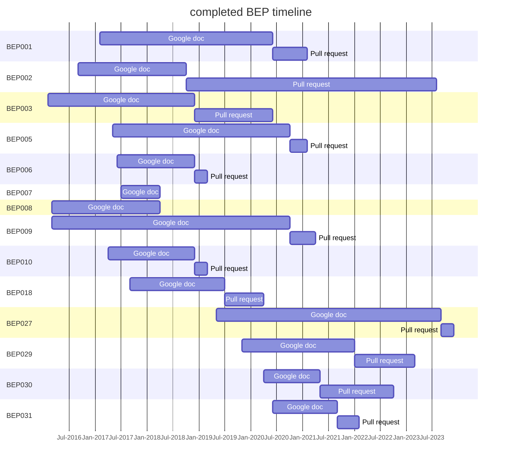

---
hide:
-   toc
---

# BIDS extension proposals

You can contribute to ongoing BIDS Extension Proposals (BEPs).

Below is a table of currently-active BEPs.

Note that all of the extension ideas that are not backwards compatible and thus will have to wait for BIDS 2.0 are listed on the
[Issues page of the bids-2-devel GitHub repository](https://github.com/bids-standard/bids-2-devel/issues).

{{ MACROS___generate_beps_table(file="beps.yml") }}

## Completed BEPs

When an extension reaches maturity it is merged into the main body of the specification.
Below is a table of BEPs that have been merged.

The references of the final publication for those BEPS
can be found in the BIDS [specification](https://bids-specification.readthedocs.io/en/latest/01-introduction.html#datatype-specific-publications).

<!-- MERMAID GANTT CHART STARTS -->

<!-- MERMAID GANTT CHART ENDS -->

{{ MACROS___generate_beps_table(file="beps_completed.yml", type="completed") }}

 

Some proposals that set out to extend the BIDS specification have instead lead to other outcomes such as:

-   becoming tools for handling BIDS
-   having been merged into other BEPs
-   having been dropped from consideration

See the table below:

{{ MACROS___generate_beps_table(file="beps_other.yml", type="other") }}
