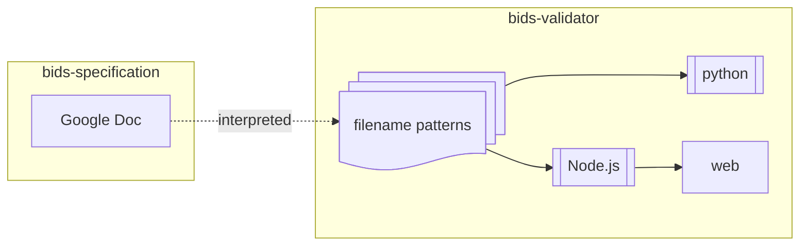
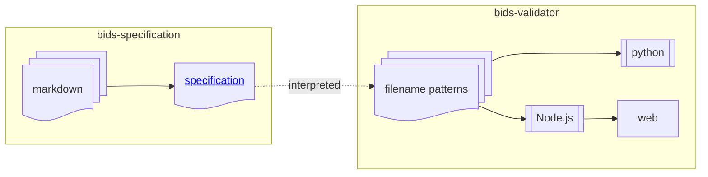
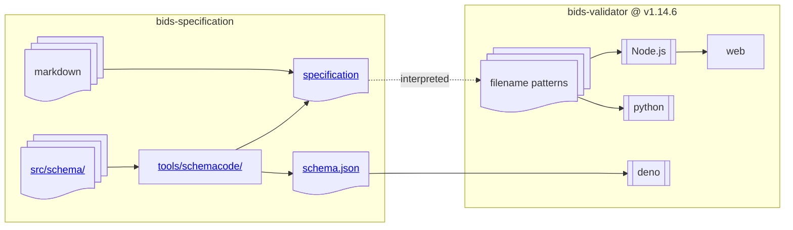
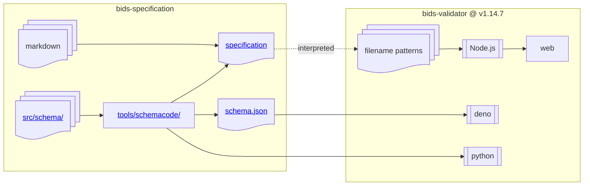
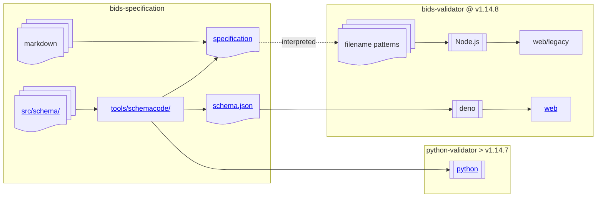
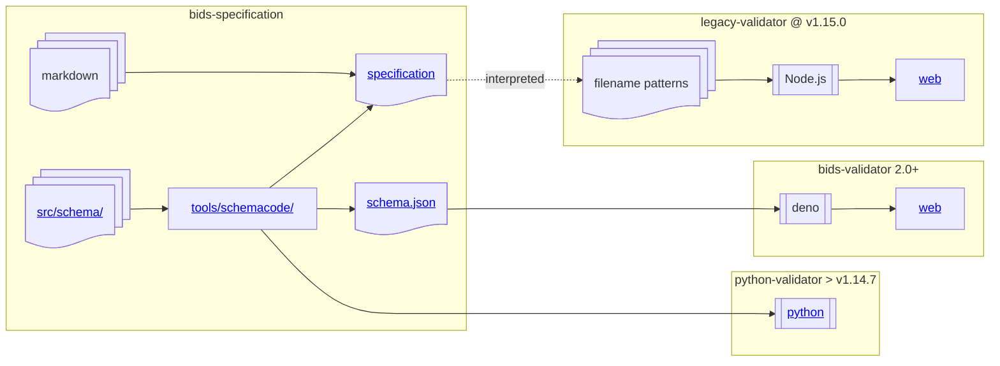

# BIDS Validator 2.0

We are pleased to announce the release of version 2.0 of the BIDS Validator.

In the last few months, you may have noticed changes to the validator available at
<https://bids-standard.github.io/bids-validator/>, including the look and feel of the
validator, the errors and warnings that are produced by the validator,
and a link to a "legacy validator".
In this blog post, we'll explain what all this means and how to use the new validator.

<!-- more -->

## Background

One of the primary goals of the BIDS validator was to make it easy to validate a BIDS
dataset, regardless of the user's operating system. By using Javascript and hosting a web
app that ran entirely in the user's browser, we were able to achieve this goal without
requiring users to install anything. This decision was crucial to the success of the validator,
which in turn was crucial to the success of BIDS.

This decision came at a cost, however. While programming expertise and open source development
are prevalent and valued in the neuroimaging community, most of that expertise is in Python,
R and MATLAB (and to some extent C/C++), and relatively few researchers have much experience
with Javascript. As a result, as BIDS grew with BIDS Extension Proposals (BEPs), updating the
validator to support the new data types and enforce the new rules became a consistent
bottleneck.

### The BIDS Schema

In the summer of 2021, the BIDS [Steering Group][] approved the development of the BIDS Schema,
a project to encode as much of the BIDS Standard as possible in declarative,
machine-readable rules, and to rewrite the validator to use the schema to enforce the rules.
This would have several advantages:

1.  A schema could be updated by BIDS contributors without knowledge of Javascript or an
    understanding of the structure of the BIDS Validator code base.

1.  A language agnostic schema would enable validators to be written in other languages,
    or for other tools to be written in a way where updates to BIDS could be automatically
    incorporated by upgrading the schema.

1.  By using the schema as an authoritative source of definitions,
    large portions of the *text* of the BIDS specification could be generated automatically,
    and with less chance for inconsistency.

A description of the BIDS schema can be found in the [bidsschematools][bst desc] documentation,
and the schema itself may be found at
<https://bids-specification.readthedocs.io/en/latest/schema.json>.
(Replace `latest` with a particular version, for example,
`v1.10.0`, to find a snapshot of the schema at the time of that release.)

## The Schema Validator

The schema validator is now feature complete, validating file names,
JSON file fields and values, TSV file column names and values,
and various [checks] that have been written in the schema expression language.

To use the schema validator, visit <https://bids-standard.github.io/bids-validator/>
or download the [Deno] Javascript runtime and run:

```console
deno run -A jsr:@bids/validator [PATH]
```

While many features of the original BIDS validator have been preserved,
the structure of JSON configuration files and JSON outputs
(triggered by the `--json` flag) have changed their formats.
Advanced users may need to update their tooling on either end.

### New features

The schema validator includes features that were never implemented in the
legacy validator:

-   Validation of [BIDS Derivatives] (introduced in BIDS 1.4.0) datasets,
    including opt-in recursive validation of BIDS Derivatives datasets discovered in
    `derivatives/` subdirectories.

-   Support for [BIDS-MRS] (Magnetic Resonance Spectroscopy),
    introduced in BIDS 1.10.0.

### Behavior changes

-   The [inheritance principle][] is consistently applied for all files.
    For example, a top-level `bold.json` was previously singled out to be
    invalid without a `task` entity.

-   Every JSON field or TSV column defined in BIDS is type-checked against the
    schema definitions used to produce the tables in the specification.
    (For example, [`FlipAngle`][flipangle] is verified to be a number, rather
    than a string with a degree symbol.)
    Improved conformity reduces the scope for inconsistency for downstream tools
    to accommodate.

-   Extra metadata is no longer prohibited in sidecar JSON files, which was
    inconsistently applied across data types in the legacy validator.

-   All RECOMMENDED fields produce a warning if absent.

Some of these changes may not be to everyone's taste,
but we believe that consistent application of the specification is critical
to the utility of BIDS and the maintainability of the validator.
We hope that a consistent validator will help inform future changes to BIDS,
so that the specification can get closer to the needs and preferences
of the community.

### Development validator

The BIDS Validator tracks the latest release of the BIDS specification (currently [v1.10.0]).
As the next release of BIDS is developed, changes to the schema or the validator may be
tested at <https://bids-standard.github.io/bids-validator/dev/>.

Note that any changes in this validator may be reverted prior to the next release of BIDS.
Command-line use of the development validator is not currently supported.

### Updated documentation

The original BIDS validator had limited documentation,
primarily a README that was replicated on GitHub and [NPM][npm:validator].
For the 2.0 release of the validator, we've added documentation at
<https://bids-validator.readthedocs.io/en/latest/>.

In addition to user guides for the [web][web-validator] and [command-line] interfaces
to the validator, we aim to include more detail on the operation of the validator,
starting with the [validation model][].
Our goal is to demystify the validator and the BIDS Schema and empower researchers and
developers to adapt and reuse the tools we've built.

This site is under active development, and will be updated frequently in the
coming weeks. Please help us improve it by opening issues (or PRs)!

## Questions

### Q1. My dataset was valid with the old validator but it is not anymore. Why? Which one should I trust?

The validator has been completely reimplemented and shares no code with the
original validator. A new failure could mean a bug in the new validator, but
it is more likely to indicate a blind spot in the legacy validator. For
example, the legacy validator spot-checked many JSON sidecar fields with custom
code; in contrast, the schema validator systematically checks every sidecar
field for applicability, and validates the types of the values according to the
definitions in the schema.

### Q2. Can I continue using the legacy validator?

Yes, but there are no plans to continue maintaining the legacy validator.
Its behavior will inevitably diverge further from that of the schema validator,
and eventually it will be difficult to get the validator to run,
as the Node.js ecosystem moves on.
The Docker images will continue to work for longer.

We recommend migrating to the schema validator sooner than later,
and report any bugs you find in the process.

### Q3. Where should I report bugs?

The same place as ever: <https://github.com/bids-standard/bids-validator/issues>

Note that in some cases the fixes for the bugs will be in the specification
itself, as the bug may be in the schema-defined rules that the validator is
applying.

### Q4. What about the Docker image?

The [bids/validator](https://hub.docker.com/r/bids/validator/) image
still contains the legacy validator, as of version 1.15.0.
Compared to Node.js, the Deno runtime removes most of the complicated parts
of package installation, which reduces the benefit-to-cost ratio for
containerization.
However, if you see version 2.0 or higher, it will be the schema validator.

The [bids/base_validator](https://hub.docker.com/r/bids/base_validator/)
image contains the schema validator, as of version 1.15.0.
This image is intended for building BIDS Apps that pre-validate the
dataset, but can also be used with:

```shell
docker run --rm -it --platform linux/amd64 -v $DATASET:/data bids/base_validator \
    bids-validator /data
```

## Some technical details

In this section, we lay out some details that are probably not of general interest,
but could be useful for understanding the changes to validator behavior,
the validation resources available, and the planned maintenance levels.

### Evolution of the specification and validators

#### In the beginning…

<figure>



<caption>The original validator was an interpretation of a pure text specification.
The filename patterns were shared between the full Node.JS validator
and a minimal Python validator.
</caption>
</figure>

The BIDS specification was a Google Document and the validator implemented every
rule with a custom Javascript function.
For validating file names, a hand-curated list of [regular expressions] were used
by both the Javascript validator and a small Python library ([bids-validator][py]).

In 2018, the specification was transitioned to a [Markdown] site,
hosted at [bids-standard/bids-specification].

<figure>



<caption>The transition to a git-managed Markdown document initially made
change-tracking and contribution to the specification more transparent.
</caption>
</figure>

#### v1.14.6

<figure>



<caption>The BIDS schema is used as an authoritative,
machine-readable source for the specification text and tools wishing
to work with BIDS terms.
Node.js, Python and Deno validators coexisted in a single repository.
</caption>
</figure>

Recently, the [bids-standard/bids-specification][] repository has hosted the Markdown
source code of the specification and the [bidsschematools][] package.
This package compiles the schema from its YAML source into a single JSON blob,
which is used for rendering the specification document and producing the
canonical `schema.json` file that can be reused.

In the [bids-standard/bids-validator][] repository, the Python and Javascript validators have
continued to coexist, along with a new validator that is written to apply the
schema, and targeting the [Deno] Javascript runtime.

#### v1.14.7

<figure>



<caption>
To prepare for separation, the Python validator dependency on the
shared regular expressions was removed.
</caption>
</figure>

In BIDS Validator v1.14.7, the Python validator was rewritten to depend
on the [bidsschematools][] package, and no longer uses the hand-written
regular expressions. At this point, the filename validation of the Python
validator matches that of the Deno (schema) validator.

#### v1.14.8

<figure>



<caption>The Python validator was moved into its own repository.
Its versioning and development are no longer tied to the Javascript
validators.
</caption>
</figure>

After the release of v1.14.7, the Python validator was
removed from the [bids-standard/bids-validator] repository and
relocated to the [bids-standard/python-validator] repository.
Its development, if any takes place, will be independent of
the Javascript validator(s).
Its filename validation will be updated with new releases of [bidsschematools].

The legacy validator was moved to <https://bids-standard.github.io/bids-validator/legacy/>.

#### v2.0

<figure>



<caption>In version 2.0, the Deno validator removed the Node.js
validator from its source tree.
</caption>
</figure>

For bids-validator 2.0, we have fully separated the Node.js and deno
validators.

The Node.js validator repository has been renamed to [bids-standard/legacy-validator].
No further development is planned for this repository. The legacy validator will
continue to be usable at <https://bids-standard.github.io/legacy-validator/> for the
foreseeable future, but it will not receive updates as the standard evolves.

[bids-standard/bids-validator] will only host the schema-based validator from now on.
We hope that the vast majority of updates will take place in the schema itself,
inside the [bids-standard/bids-specification] repository.

[bids-standard/python-validator]: https://github.com/bids-standard/python-validator

[bids-standard/bids-validator]: https://github.com/bids-standard/bids-validator

[bids-standard/legacy-validator]: https://github.com/bids-standard/legacy-validator

[bids-standard/bids-specification]: https://github.com/bids-standard/bids-specification

[bidsschematools]: https://bidsschematools.readthedocs.io/en/latest/

[bst desc]: https://bidsschematools.readthedocs.io/en/latest/description.html#organization-and-syntax

[steering group]: https://bids.neuroimaging.io/governance.html#bids-steering-group

[checks]: https://github.com/bids-standard/bids-specification/tree/master/src/schema/rules/checks/

[deno]: https://deno.com

[regular expressions]: https://en.wikipedia.org/wiki/Regular_expression

[py]: https://pypi.org/project/bids-validator/

[markdown]: https://en.wikipedia.org/wiki/Markdown

[flipangle]: https://bids-specification.readthedocs.io/en/stable/modality-specific-files/magnetic-resonance-imaging-data.html#rf-contrast

[bids derivatives]: https://bids-specification.readthedocs.io/en/stable/derivatives/introduction.html

[bids-mrs]: https://bids-specification.readthedocs.io/en/stable/modality-specific-files/magnetic-resonance-spectroscopy.html

[npm:validator]: https://www.npmjs.com/package/bids-validator

[web-validator]: https://bids-validator.readthedocs.io/en/latest/user_guide/web.html

[command-line]: https://bids-validator.readthedocs.io/en/latest/user_guide/command-line.html

[validation model]: https://bids-validator.readthedocs.io/en/latest/validation-model/index.html

[v1.10.0]: https://bids-specification.readthedocs.io/en/v1.10.0/

[inheritance principle]: https://bids-specification.readthedocs.io/en/latest/common-principles.html#the-inheritance-principle
