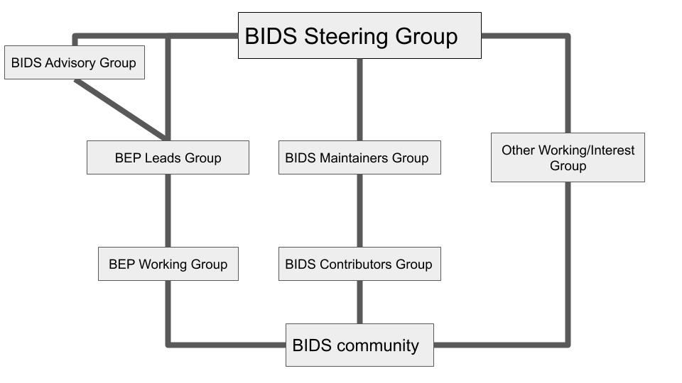

# Governance and Decision Making

## 1. Introduction

This document, *Brain Imaging Data Structure (BIDS): Governance and Decision Making*,
intends to describe the BIDS mission, its principles,
its scope, the leadership structure, governance over the standard development process,
and to define the different groups and roles.
BIDS is a community-built and maintained standard.
The goal of this document is to clearly describe how BIDS is maintained and grown.

## 2. Background

### A. Project Summary

The Brain Imaging Data Structure (BIDS) is a standard specifying the
description of neural and associated data in a filesystem hierarchy and of the
metadata associated with the imaging data.
The current edition of the standard is available in
\[HTML]\[specification] with all
the previous editions available since October 2018 (listed in the
[Changelog](https://bids-specification.readthedocs.io/en/stable/CHANGES.html)). The pre-October 2018 specification editions can be found in this \[repository]\[bids\_website\_gh] as PDFs.
The development edition is available in
\[HTML]\[specification].
The specification is based in a \[GitHub repository]\[specification\_gh]
and rendered with [ReadTheDocs](https://docs.readthedocs.io/en/stable/).

We strive for community consensus in decision making.
This governing model and decision making procedure was developed through
the review of several governance models across the informatics and computing field.

The project is a community-driven effort.
BIDS, originally OBIDS, was initiated during an INCF sponsored data
sharing working group meeting (January 2015) at Stanford University.
It was subsequently spearheaded and maintained by Chris Gorgolewski.
In the transitional period after Chris Gorgolewski's departure in early 2019
and before the community's acceptance of the present governance in late 2019,
the project was managed and maintained by Franklin Feingold, Stefan Appelhoff, and the Poldrack Lab at Stanford.
BIDS has advanced under the direction and effort of its contributors,
the community of researchers that appreciate the value of standardizing neural and associated data to facilitate sharing and analysis.
The project is multifaceted and depends on contributors for:
specification development and maintenance,
[BIDS Extension Proposals (BEPs)](../extensions/beps.md),
software tools,
[starter kits](https://bids.neuroimaging.io/getting_started/),
\[examples]\[bids\_examples\_gh],
and general discussions.
The relevant discussions are located in our
\[Google Group]\[bids\_google\_group],
\[GitHub organization]\[bids\_standard],
and public Google Documents (typically associated with an [extension proposal](../extensions/beps.md)).

A key component of the BIDS initiative is the collection of associated
software tools and platforms that facilitate the validation and ease the
use of BIDS-formatted datasets.
BIDS converters (for example, [HeuDiConv](https://github.com/nipy/heudiconv)) enable the streamlined
conversion of raw imaging files (for example, DICOMs) into a BIDS dataset, the
\[BIDS validator]\[bids\_validator] allows
users to confirm that a given dataset complies with the current edition
of the standard, the [PyBIDS](https://github.com/bids-standard/pybids)
Python and [bids-matlab](https://github.com/bids-standard/bids-matlab)
libraries allow querying and manipulating BIDS-compliant datasets,
[BIDS-Apps](https://bids.neuroimaging.io/tools/bids-apps.html) for running portable
pipelines on validated BIDS datasets, and platforms like
\[OpenNeuro]\[openneuro] store and serve BIDS datasets. Note
that the associated software does not fall under the same governance
structure as BIDS, although the contributor and user base may largely
overlap.

### B. BIDS Mission Statement

The goal of BIDS is to make neural and associated data more accessible,
shareable, and usable by researchers. To achieve this goal, BIDS seeks
to develop a simple and intuitive way to organize and describe
neural and associated data. BIDS has three foundational
principles:

1.  To minimize complexity and facilitate adoption, reuse existing
    methods and technologies whenever possible.

1.  Tackle 80% of the most commonly used neural data, derivatives,
    and models (inspired by the pareto principle).

1.  Adoption by the global neuroscience community and their input during
    the creation of the specification is critical for the success of the project.

## 3. Leadership structure

To achieve the goals of widespread adoption of the standard while
growing to adapt to its community of members, BIDS is led by a series of groups.

The following figure illustrates the structure of the groups described
in this document. The specific organization and responsibilities of
these groups are laid out in detail, below.

### BIDS Steering Group

The BIDS Steering Group is responsible for approving and advancing BEPs
through the BIDS standard process, as well as more general decisions
regarding the standard. The BIDS Steering Group aims to preserve the
longevity and sustainability of the BIDS standard. The BIDS Steering
Group consists of 5 members, including the chair.

Membership on the BIDS Steering Group is through elections by BIDS
Contributors. BIDS Steering Group terms are 3 years.
The existing BIDS Steering Group is responsible for filling open
positions, ensuring that at least two nominees are named for each
position, that multiple imaging modalities (for example, MRI, MEG) are
represented on the final committee, and the different needs for the
specification (for example, users vs software developers). Given that the
modalities included in BIDS will continue to evolve, we do not recommend
a precise mechanism for this balance. It is therefore at the discretion
of the Steering Group to ensure that modalities are appropriately
represented. The chair is elected by a majority of the BIDS Steering
Group (3 votes) to serve for a 1 year term. The chair cannot serve two
consecutive years as chair. BIDS Steering Group members may hold other
BIDS roles at the same time, for example BEP Working Group chair.

The BIDS Steering Group is the authority of last resort in addressing
conflicts among groups and alleged violations of the [Code of Conduct](./bids_github/CODE_OF_CONDUCT.md).

The Steering Group may delegate tasks as needed to fulfill its responsibilities.

The current members of the Steering group are:

{{ MACROS\_\_\_generate\_members\_table(file="steering.yml") }}

Past members of the Steering group are:

{{ MACROS\_\_\_generate\_members\_table(file="past\_steering.yml") }}

### BIDS Maintainers Group

This group is responsible for maintaining the \[BIDS specification on
GitHub]\[specification\_gh]. The Lead
Maintainer and the Maintainers Group will determine how they organize
their work, detailed in the [BIDS Maintainers Group Guide](https://github.com/bids-standard/bids-specification/blob/master/Maintainers_Guide.md) and in accordance with the BIDS Code of Conduct.
The BIDS Maintainers Group Guide is subject to Steering Group approval and amendment.
BIDS contributors may self-nominate to become maintainers,
with approval by a majority vote of current maintainers.

This group submits
[monthly status summaries](https://github.com/bids-standard/bids-specification/wiki/BIDS-Maintainers-Documents#bids-maintainers-reports)
to the Steering Group.

The current members of the Maintainers group are:

{{ MACROS\_\_\_generate\_members\_table(file="maintainers.yml") }}

Past members of the Maintainers group are:

{{ MACROS\_\_\_generate\_members\_table(file="past\_maintainers.yml") }}

If you need to contact the maintainers on a specific topic you can use the following email: `bids.maintenance@gmail.com`.
However, you may receive a more timely response when pinging them on one of the GitHub repositories using the tag `@bids-standard/maintainers`.

### BIDS Contributors Group

This group consists of individuals who have contributed to the BIDS
community. Group members are identified on the [BIDS
contributors](https://bids-specification.readthedocs.io/en/latest/appendices/contributors.html) list,
a list that is intended to be inclusive of all forms of engagement with the BIDS community,
and that contributors are encouraged to update via the
[specification wiki](https://github.com/bids-standard/bids-specification/wiki/Recent-Contributors).
Engagement can range from writing copy text in the specification
to providing feedback on projects such as the
[BIDS starter kit](https://bids-standard.github.io/bids-starter-kit/).

Members of the BIDS Contributors Group are encouraged to support the
BIDS specification by supporting the members of the Maintainers Group in
their responsibilities.

An *Active Contributor* is defined as a contributor that is reachable via
the email address they provided to the BIDS Maintainers team,
and responds to correspondence by the BIDS group
(for example, Maintainers/Steering Group or the BIDS community at large).
Contributors may explicitly opt in or out of activity at any time.
The Maintainers Group is responsible for providing transparent procedures for
contributors to opt in/out as well as providing procedures for
removing non-responsive members from the list of active contributors.
In case of no response,
a grace period of two years is in place before a formerly active contributor
loses their "active" status.

### BIDS Advisory Group

The purpose of this group is to provide advice and guidance to the BIDS Steering
Group and the BEP Leads Group.
When a BEP is merged into the specification,
the associated BEP Lead(s) automatically join the advisory group.
Members are encouraged to participate for at least 2 years following
the merge of their BEP.
If an advisory group member decides to leave the advisory group,
they should inform the steering group in advance and are responsible to help:

-   provide a list of possible replacement candidates from the BIDS community
    with a similar level of expertise to theirs, and

-   assist the steering and maintainers in choosing a suitable replacement.

{{ MACROS\_\_\_generate\_members\_table(file="advisory.yml") }}

### Other working groups

A working/interest group can be established under the approval of the BIDS Steering Group.
This is typically but not limited to being formed for the purpose of advancing the BIDS community, not the standard.

Each group will appoint 1-2 chairs.
Members of these groups can have cross appointments in other groups.
These groups do not necessarily dissolve after some duration or event, unless stated in their proposal.

The working/interest group formation is formalized
through an open letter via a "read-only" Google Document addressed to the BIDS Steering Group.
The open letter will be posted on:

-   the \[BIDS-Specification GitHub repository]\[specification\_gh],
-   \[Google Group]\[bids\_google\_group],
-   and [social media channels](https://github.com/bids-standard/bids-specification?tab=readme-ov-file#BIDS-communication-channels).

This proposal will state what their group aims and goals are.

### BIDS Community

Along with members of the preceding groups, this group comprises broadly
any individual who has used or has interest in using BIDS. All members
are invited, and encouraged to join the BIDS Contributor Group by
supporting the project in one of the many ways listed in the ["All
Contributors" emoji key](https://allcontributors.org/docs/en/emoji-key).
All community members are welcome to join BEP Working Groups and other
working and interest groups.

The current BEP Working Groups and their leads can be found in the
section on [BIDS Extension Proposals](../extensions/beps.md)
in the BIDS specification.

## 4. Governance of the standardization process

### A. Principles for open standards development

The BIDS approach to standards development follows the principles of the
[Modern Paradigm for
Standards](https://open-stand.org/about-us/principles/) developed by
OpenStand:

1.  Respectful cooperation between standards organizations

1.  Adherence to fundamental principles of standards development:
    -   Due Process
    -   Broad Consensus
    -   Transparency
    -   Balance
    -   Openness

1.  Collective empowerment

1.  Availability

1.  Voluntary adoption

### B. Standard decision making process overview

The foundation of BIDS decision making is listening to all members of the BIDS Community
and striving to achieve consensus on each level of the BIDS standard process.

The criteria for making changes to the standard via a BEP (or otherwise) are laid out
[here](../extensions/guidelines.md) on the bids website while the formal process for
creating and integrating a BEP into the standard are defined outside of this governance
[here](../extensions/process.md). That process is version controlled on the bids-standard github
at [bids-standard/bids-website](https://github.com/bids-standard/bids-website).

Defining the BEP process outside of this governance enables BIDS to be more reponsive
and dynamic.
Changes, improvements, or suggestions regarding the BEP process may be proposed by any
member of the community via the submission of an issue and/or pull request to the process at
[github.com/bids-standard/bids-website](https://github.com/bids-standard/bids-website). Following
a final approval by a majority of the Steering Group amendments/changes may be applied to the
BEP Process. All discusion and final approval/disapproval of BEP must be a part of the public
record.

A newer version of the BEP Process may not be applied retroactively to an approved BEP/BEP
Working Group barring the BEP Lead(s) consent. Once a BEP is started the Git hash
associated with the BEP process is noted and linked to the BEP. Should BEP Lead(s)
choose to adopt a *newer* version of the process the Git hash of that newer version
will be recorded along with their starting process hash.

## X. Appendix

### A. BEP Procedure: Key definitions

#### BIDS Specification

This is the \[BIDS specification]\[specification].
This covers the current raw data organization for brain MRI, MEG, EEG, and iEEG.

#### BIDS Extension Proposal (BEP)

A proposal that intends to extend BIDS into an unspecified modality or derivative.
A BEP is typically led by 1-3 individuals with several contributors.
The [list of BEPs](../extensions/beps.md)
can be found elsewhere on this website.

### B. Voting Procedure

The BIDS Steering Group is elected by a vote of the active BIDS Contributors Group.
At the discretion of the BIDS Steering Group,
additional elections may be called and propositions may be put before
the community in the course of a Steering Group election.

Elections will be managed through a 3rd party platform that allows
restricting votes to a specific set of email addresses while maintaining
the anonymity of the votes. A list of email addresses from the
Contributors Group will be maintained by the Steering Group for the
purposes of announcing elections and will not be used for any other
purpose and will never be analyzed together with voting data.

Each Contributor will receive an email with information regarding the
vote and the link to submit the vote. The information will contain a
brief summary of what the vote is about with links to the relevant
issues, as well as the deadline for the vote.

For Steering Group members, a ranked choice/instant runoff voting scheme
will be used. Propositions will be yes/no questions, with the outcome
determined by a simple majority. Voters may abstain on any ballot item.

A vote will be considered valid if at least 20% of the Contributors
submit votes.

### C. Governance ratification and BIDS Steering Group initialization

In order to establish a governance procedure at the same time as a
governing body, certain variations in the normal order are required.

Initially, Steering Group members will be elected for staggered terms of
2/3/4 years, to allow continuity and overlap across years. This will
ensure institutional knowledge is preserved within the BIDS Steering
Group. In the initial BIDS Steering Group, there will be at least one
non-MRI modality represented.

The Steering Group member nominations were put forth by the BIDS
Community from August 7-28, 2019. The nominees self-organized into
slates of five candidates, with an identified Chairperson. Nominees were
eligible to participate in multiple slates. The community will vote
among these slates in a ranked choice/instant runoff voting scheme.

Because there are no grounds to restrict the vote to the BIDS
Contributors Group prior to the ratification of this document, the
electorate is to be the BIDS community, construed broadly as anybody
with an interest in voting. The votes will be cast with two Google
Forms: one to capture the vote and the other to record email addresses.
The email addresses will not be analyzed together with the voting data,
except to identify a situation in which many more votes are collected
than valid email addresses. If the situation arises that the legitimacy
of the vote is called into question, then the email addresses will be
used to hold a special election under the terms laid out in Appendix B,
according to which,

Elections will be managed through a 3rd party platform that
allows restricting votes to a specific set of email addresses while
maintaining the anonymity of the votes.

### D. License

To the extent possible under the law, the authors have waived all
copyright and related or neighboring rights to the BIDS project
governance and decision-making document, as per the [CC0 public domain
dedication /
license](https://creativecommons.org/publicdomain/zero/1.0/).

### E. Help

The [bids.neuroimaging.io](http://bids.neuroimaging.io/) website
contains links to all the BIDS informational and help materials.

We encourage questions and discussion  on [NeuroStars, under the "bids"
tag](https://neurostars.org/tags/bids), via the \[BIDS mailing
list]\[bids\_google\_group], or in
\[GitHub issues]\[bids\_standard] within the
appropriate repository.

We prefer questions to be asked via
[NeuroStars](https://neurostars.org/tags/bids) so that others can search
them and benefit from the answers, but if you do not feel comfortable
asking your question publicly please feel free to email the BIDS maintainers at
<bids.maintenance+question@gmail.com>. They will
repost an anonymised/general version of your question on
[NeuroStars](https://neurostars.org/tags/bids) and answer it there.

There are several resources that can help a new user get started.
We have a [starter kit GitHub
repository](https://bids-standard.github.io/bids-starter-kit/) that has
example BIDS file structures, wikis, and tutorials, and the [Stanford
Center for Reproducible Neuroscience
blog](http://reproducibility.stanford.edu/blog/) provides tutorials and
community survey results.

All BIDS community members are required to follow the
[BIDS code of conduct](./bids_github/CODE_OF_CONDUCT.md).
Please contact the BIDS maintainers at <bids.maintenance+coc@gmail.com>
if you have any concerns or would like to report a violation.

### F. Acknowledgments

This document draws heavily from the
[Modern Paradigm for Standards](https://open-stand.org/about-us/principles/)
and from other open-source governance documents including:

-   <https://numpy.org/doc/stable/dev/governance/index.html>
-   <https://docs.scipy.org/doc/scipy/dev/governance.html>
-   <https://www.ieee.org/about/corporate/governance/index.html>
-   <https://www.apache.org/foundation/governance/>
-   <https://www.niso.org/what-we-do/creating-NISO-standards>
-   <https://chrisholdgraf.com/blog/2018/rust-governance>
-   <https://www.seedsforchange.org.uk/consensus>
-   <https://en.wikipedia.org/wiki/Internet_governance>
-   <https://www.icann.org/resources/pages/governance/guidelines-en>
-   <https://github.com/bids-standard/bids-specification/pull/104>
-   [Drupal's Governance](https://randyfay.com/content/drupals-governance)
-   [Drupal community's governance process](https://git.drupalcode.org/project/governance/-/blob/main/README.md)

### G. Election data and code

Anonymous data from BIDS elections is stored in a dedicated repository on GitHub:
<https://github.com/bids-standard/bids-elections>

### H. Governance amendment procedure

A group of BIDS contributors may at any time form a [working group](#other-working-groups) to propose amendments to the governance.
These amendments will be first reviewed by the Steering Group before being
submitted to a community review.
At the end of the community review each amendment is submitted to a vote of BIDS
contributors.
The voting procedure is similar to the one described for the election of
Steering Group members in [Appendix B](#b-voting-procedure).
Amendments are accepted if they gather more than two-thirds of the expressed votes.
