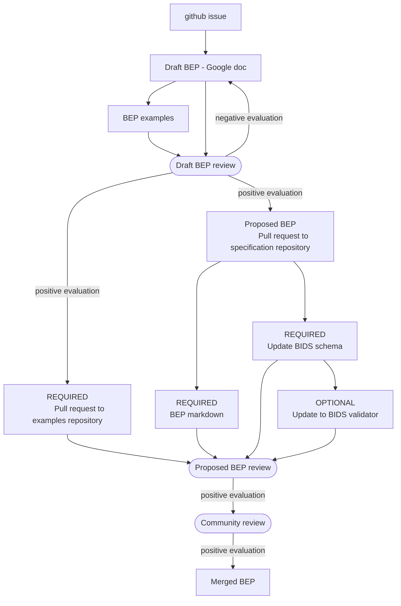
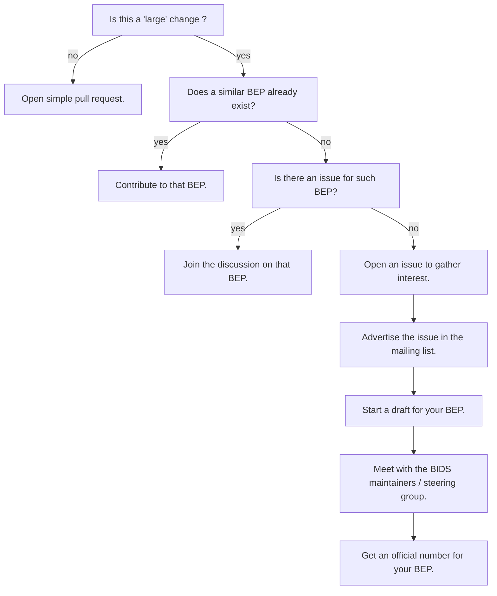
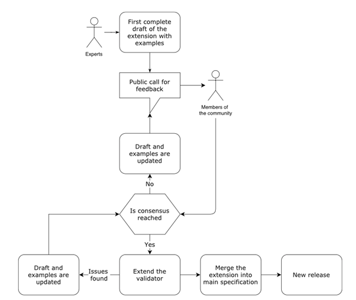

A BEP is a method of expanding the BIDS Specification to encompass new features or data types.

They are called BEPs because they are modeled after
[Python Extension Proposals](https://peps.python.org/pep-0001/#what-is-a-pep) (PEPs) as
they have been an effective community tool to change (either by updating or supplementing)
the Python programming language.
BIDS contributors adopting a similar structure has been useful to expand BIDS.

BEPs have grown the specification beyond its original scope of MRI
to new techniques, and file types and descriptors.
A list of completed BEPS can be seen [here](./beps.md#completed-beps) and
a list of proposed/ongoing BEPs can be found [here](./beps.md#bids-extension-proposals)

## Why contribute to BIDS?

You can make something that is good even better without building it from scratch.

You can interact with and get to know other experts in the field.

A more substantial extension can lead to standalone publications, as evidenced
by [abundant examples](https://bids-specification.readthedocs.io/en/latest/introduction.html#citing-bids).

## Overarching principles in the design of BIDS

The directory structure must not only be machine-readable but also easy to interpret by humans.
Readability is as important as the ability to programmatically traverse the directory structure.

When it comes to file names within directories, redundancy trumps conciseness,
so the files should be identifiable by their names even if removed from the directory structure.

If something being added to BIDS is applicable to at least 80% of use cases
that is a very good start and should be added to the specification
by either [opening a GitHub Issue here][issues page]
or by working on a BEP following [the submission process](submission.md).

## When and how to start a BIDS Extension Proposal?

Small contributions (typos, rephrasing of a description, adding a single new metadata field)
can be just added as a [Pull Request on GitHub](https://github.com/bids-standard/bids-specification/pulls)

Larger contributions that are expected
to involve longer and more involved discussions
may take the form of a BIDS extension proposal.

### Overview of the BEP process



### Starting your BEP



!!! warning "Before starting a new extension!"

    Developing a new BIDS extension a long process (think years not months)
    that requires a lot of work and coordination.

    Also take into account,
    you may be consulted **years after BEP you workded on is merged into the BIDS specification**,
    to advise regarding new update to this BEP.

    So before you embark on this journey, make sure that you have:

    -   explored [the specification][specification_gh]
        and [the BEP lists](./beps.md)
        to find existing or ongoing efforts
        that may support what you are trying to add into the BIDS Specification.
        Someone may have already done work for you.

    -   familiarized yourself with the BIDS community by browsing current issues,
        discussions, and proposed changes on
        [the bids specification repository][specification_gh].
        Search for issues relating to your feature or BEP idea
        before creating a new issue.

    If you are sure that you want to move forward, also make sure you have:

    -   read the [BIDS governance document](../collaboration/governance.md)
    -   the [BIDS code of conduct](../collaboration/bids_github/CODE_OF_CONDUCT.md)


1.  Open an initial "issue" on
    [the bids specification repository][specification_gh] issues page.

    This will help gauge interest in your potential BEP, and to collect
    feedback by more community members and
    [BIDS maintainers](https://github.com/bids-standard/bids-specification/blob/master/DECISION-MAKING.md#maintainers-group).

    **This is an important step before proceeding
    in order to make sure
    that more consensus arises and more contributors are aware what is happening.**

1.  Share a link to this issue on the [bids-discussion mailing list][bids_google_group]
    and ask for comments.

1.  Create a draft of your extension by discussing among colleagues.

    Development on Google Docs is RECOMMENDED as this is a low barrier to entry
    for colleagues who do not use GitHub and/or Markdown,
    allowing more people to get involved.
    The [BIDS Extension Proposal template](https://docs.google.com/document/d/1W7--Mf3gCCb1mVfhsoRJCAKFhmf2umG1PFkyZ1jEgMw/edit#)
    provides some boilerplate and formatting conventions.

    **Make sure to update the issue from the previous step with a link to this document.**

1.  Contact the BIDS maintainers and steering group
    to evaluate if your BEP is ready to be made official.

    We recommend doing all the following:

    -   tag the BIDS maintainers in using `@bids-standard/maintainers` in the issue of your BEP,
    -   send an email to the BIDS maintainers (bids.maintenance+question@gmail.com) and steering group (bids.steering@gmail.com).

1.  Register the BEP with a number on the BIDS website.

    To obtain a number for your BEP open [a pull request](https://github.com/bids-standard/bids-website/pulls)
    to the [website GitHub repository][bids_website_gh]
    where you provide information about your BEP
    by updating the file [`data/beps/beps.yml`](https://github.com/bids-standard/bids-website/blob/main/data/beps/beps.yml)
    using the following template:

    ```yaml
    --8<-- ".github/PULL_REQUEST_TEMPLATE/bep_template.yml"
    ```

    !!! note

        This will likely require to add (or update) information about the BEP leads
        in the list of BIDS contributors via [the BIDS specification wiki](https://github.com/bids-standard/bids-specification/wiki/Recent-Contributors#adding-yourself-as-a-contributor).

### Working on your BEP

While working on your extension, make sure to do the following:

-   Keep track of the contributor(s) leading the effort:
    name, affiliation, email...

-   Incorporate the feedback and strive for consensus.

-   Create example datasets.

    Complete source data (for example DICOM, EDF, Excel) and its corresponding target BIDS datasets,
    _must be_ supplied along with instructions on how to transform data from source to target.

    When possible, data from multiple vendors
    such as Siemens, Philips, or General Electric (in the case of MR) should be included.

    These datasets are vital for the development of resources
    that will, ultimately, increase the adoption of the BEP following its integration into the BIDS Specification;
    see [this discussion](https://github.com/bids-standard/bids-specification/issues/1350).

    BIDS maintainers **are available to assist**
    in the collection, organization, or at any step in the preparation of these datasets.

    !!! note

        Creating datasets may also happen later,
        once you have opened a pull-request for your BEP (see below),
        but we recommend doing this very early in the BEP creation process
        as this may provide valuable information with regards
        to the feasibility / complexity of the content of the BEP.

### Transitioning your BEP to a pull-request

Once you think your BEP is mature enough,
you can transition your BEP from the google doc
to the a markdown document and open a pull-request
in the [BIDS specification repository][specification_gh].

To confirm your BEP is ready for this transition,
contact the BIDS maintainers and steering group by:

-   tagging the BIDS maintainers in using `@bids-standard/maintainers` in the issue of your BEP,
-   sending an email to the BIDS maintainers (bids.maintenance+question@gmail.com) and steering group (bids.steering@gmail.com)

Once this is done, the BIDS maintainers will:

-   create a branch for your BEP on the BIDS specification repository
-   create a github team for that BEP and add the BEP lead to that team
-   grant write access to BEP branch to that BEP team

We suggest first converting your entire google doc to markdown.
Note there is a [google doc add-on](https://workspace.google.com/marketplace/app/docs_to_markdown/700168918607)
to help you with this.
You can then add this document to your BEP branch before opening a pull request.

<!--

TODO update figure about BEP process
use a mermaid diagram ?


-->

## Advice for extending BIDS

### Limit flexibility, consider tool developers

One of the aims of BIDS is to make reusing data easier.
This means that when proposing an extension you need to put yourself
in the shoes of someone who will receive a BIDS dataset and attempt to analyze it.
Additionally, consider developers that will try to write tools that take BIDS datasets as inputs.
It is worth assessing how much additional code different ways of approaching your extension may cause.

The most common situation where the trade-off between flexibility and ease of
tool building comes up is in choosing file formats.
For example, allowing multiple different file formats to be used to represent the same data type is flexible,
but requires developers to provide support for all of them.
As an example, iEEG-BIDS and EEG-BIDS
surveyed the community <!--TODO find links  -->
to find out about most common formats and selected only a few formats based on usage and their openness.

### Get the community involved

Try to reach out to colleagues working with the type of data you are trying to add support for.
The more people looking at your extension the better it will become through discussions.

### Be consistent with the main specification

The main specification follows some general rules.
For example, see the [rules on participant labels](https://bids-specification.readthedocs.io/en/stable/02-common-principles.html#participant-names-and-other-labels).

Try not to deviate from BIDS conventions in your extension.

### Be consistent with other BEPs

A common dictionary (BIDS keys) is what makes BIDS successful,
it is thus essential to not create many new entities.
Many of the current BEPs have developed useful terms that we recommend here.

#### Existing entities

| Entity        | BEP(s)          | Description                                                                                                                                                                                                                                                                                                                                                                                                                                                                                                                                      |
|---------------|-----------------|--------------------------------------------------------------------------------------------------------------------------------------------------------------------------------------------------------------------------------------------------------------------------------------------------------------------------------------------------------------------------------------------------------------------------------------------------------------------------------------------------------------------------------------------------|
| desc-<label>  | BEP003 (merged) | Alphanumeric label, for any use, up to pipelines to determine what are valuable, for example,  Common desc acronyms: lp30: low pass filtered at 30 Hz hp05: high-pass filtered at 0.5 Hz reref: re-references to another electrodemc: motion corrected sm: smoothed pvc: partial volume corrected McPvc: motion and partial volume corrected  Note: concatenation of the above is possible, preferable in the order in which they were applied when applicable: like McPvc, RerefLp30. PascalCase is recommended when concatenating descriptions |
| space-<label> | BEP003 (merged) | Name of space file is aligned to (standard or non-standard)                                                                                                                                                                                                                                                                                                                                                                                                                                                                                      |
| res-<label>   | BEP003 (merged) | Identifier for spatial resolution (details in sidecar)                                                                                                                                                                                                                                                                                                                                                                                                                                                                                           |
| den-<label>   | BEP003 (merged) | Identifier for mesh density (details in sidecar)                                                                                                                                                                                                                                                                                                                                                                                                                                                                                                 |
| label-<label> | BEP003 (merged) | Label of ROI described by mask file                                                                                                                                                                                                                                                                                                                                                                                                                                                                                                              |
| hemi-{L\|R}   | BEP011          | File describes left or right hemibrain                                                                                                                                                                                                                                                                                                                                                                                                                                                                                                           |
| seg-<label>   |                 | As per current atlas definition a label the user MAY use to distinguish a different segmentations, like `atlas/atlas-DKT_space-FSaverage.nii` `sub-01/sub-01_space-T1_seg-DKT_dseg.nii` (are there current uses of the `atlas` key that would be broken changing to `seg`?)                                                                                                                                                                                                                                                                      |

#### Proposed entities

| Entity        | BEP(s)                                                                                   | Description                                                                                                                                                                                                                                                                                                                                                                                                   |
|---------------|------------------------------------------------------------------------------------------|---------------------------------------------------------------------------------------------------------------------------------------------------------------------------------------------------------------------------------------------------------------------------------------------------------------------------------------------------------------------------------------------------------------|
| model-<label> | BEP016, BEP039                                                                           | Name of model generating derivative file                                                                                                                                                                                                                                                                                                                                                                      |
| param-<label> | BEP016, BEP039                                                                           | Name of parameter represented by file                                                                                                                                                                                                                                                                                                                                                                         |
| atlas-<label> | BEP003, BEP038                                                                           | Atlas is defined as per Merrian-Webster, a bound collection of maps (i.e. labeled brain regions) and metadata (tables, or textual matter) like `atlas-x_space-MNI305_ext` or `atlas-DKT_ext`                                                                                                                                                                                                                  |
| group-<label> | BEP039                                                                                   | Name of group combining over subjects                                                                                                                                                                                                                                                                                                                                                                         |
| node-<label>  | No BEP (BEP-002 working implementation)                                                  | Name of processing node generating derivative file                                                                                                                                                                                                                                                                                                                                                            |
| stat-<label>  | BEP016 (contemplated but not currently present in proposal), also useful for atlas BEP38 | The theory was that one could like computing the mean value across all values in a time series, or within a DWI shell, or the like. The particular aggregate statistic may not be an adequate descriptor; you could also need eg. the axis along which the aggregate was applied, which elements were or were not included in the aggregate... So it might be too much complexity to hand to a single entity? |
| meas-<label>  | BEP017,BEP23                                                                             | Description of the quantity described by the file when the suffix is insufficient (eg. binding value, relaxation time)                                                                                                                                                                                                                                                                                        |

### Derivatives BEP and provenance

The objective of BIDS is to promote data sharing, ensuring that the information is
easily accessible and reusable.
For this purpose, it is highly recommended to provide comprehensive provenance information
to ensure transparency and traceability
While full provenance can be used for full reproducibility, it is not a pre-requirement.
A suggested approach to developing the BEP involves envisioning each processing step,
including potential file names and JSON structures.
While this exercise might not precisely depict
the eventual output files and JSON configurations,
it's instrumental in capturing provenance
and identifying what files or information should be retained for optimal reuse in future studies.

!!! Note

    See the [FAQ on provenance](../faq/bids-extensions.md#provenance)

### Avoid backward incompatible changes

BIDS is already incorporated in many tools -
proposing a change that will render already released BIDS datasets not BIDS-compliant
will cause a lot of confusion
and will force developers to update their code.
We should strive to avoid such situations.

Having said that, one day we will have to break backwards compatibility.
If you have an idea for a backwards-incompatible change
please add it as an issue to the [BIDS 2.0 GitHub repository](https://github.com/bids-standard/bids-2-devel).

### Use existing and common practices/formats

It’s likely that certain data types are commonly stored in a particular way in your sub-field.
If this is the case try adopting this way
unless it makes your extension too inconsistent with the main specification.
A good example of such adoption is the
[bvec/bval file format](https://bids-specification.readthedocs.io/en/stable/04-modality-specific-files/01-magnetic-resonance-imaging-data.html#required-gradient-orientation-information)
for storing diffusion metadata.

### Try to link with other existing standards and ontologies

There are many standardization attempts out there.
When proposing your extension
consider gathering inspiration and directly linking to other standards.
A good example of this is linking metadata fields to corresponding DICOM tags.

## Common pitfalls

### Relying on merging the extension on a set timeline

We have found it is very difficult to predict how long a BEP
will take to merge into the standard.
One challenge that has occurred in the past is a doctoral student requiring acceptance of their work
as a requirement for graduation.
We do not recommend yoking contributions to the BIDS community
(or any volunteer-led open source community) to strict timelines
to avoid the uncertainty around domain-specific community engagement,
feedback from other BIDS contributors, and responding to reviews.

### Not considering domain- or field-specific guidelines

In many neuroscience fields there have been past developments and efforts to implement standards,
either formally or informally.
If possible, BEPs should embrace these rather than trying to come up with alternative standards.
The BEP should therefore inventorize
and review past and existing work that may be relevant to the BEP.

### Not considering DICOM fields

Many of the modalities we use have an associated standard, like DICOM for instance.
While BIDS is not specifically about data format, a lot of metadata information
are stored in data files and there is rarely a good reason for using a different name
than one from other established standards.
In using DICOM it is reasonable to
[check what DICOM has already developed](https://www.dicomstandard.org/)
and see if there is overlap.
In a similar fashion, when relevant, we recommend having a `sourcedata/` directory in example datasets to include DICOM files.
You can delete the data and keep the header,
removing any [personally identifying information](https://www.datacenters.com/news/everything-you-need-to-know-about-pii-personal-identifiable-information),
also known as PII or "Personal Data"
under the [General Data Protection Regulation (GDPR)](https://en.wikipedia.org/wiki/General_Data_Protection_Regulation).

### Not building up a user community to support the BEP

Merging BEPs only happens following a community review.
It is therefore helpful to get the stakeholders on board early
(that is while writing the BEP) rather than at the review stage.
Diversity in the team contributes to the quality of the extension proposal.
We recommend that the core team has representatives from 3 different labs,
preferably also with a mix of more junior and more senior contributors.
You may also consider requesting explicit support letters from external labs.

[issues page]: https://github.com/bids-standard/bids-specification/issues
