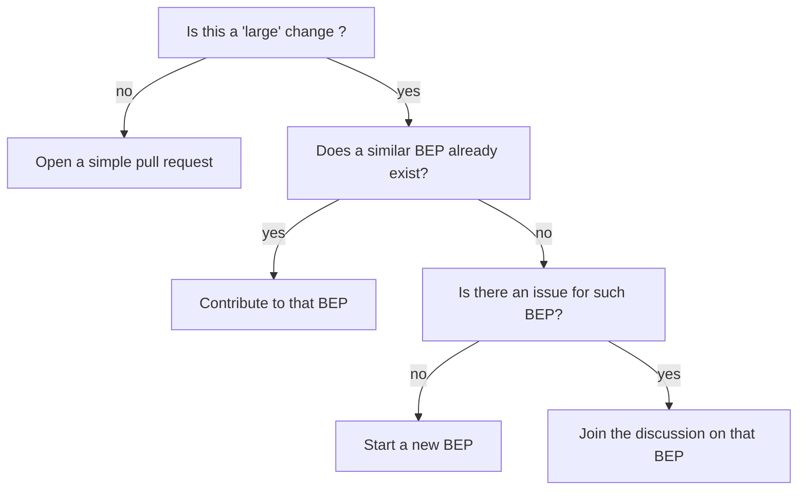
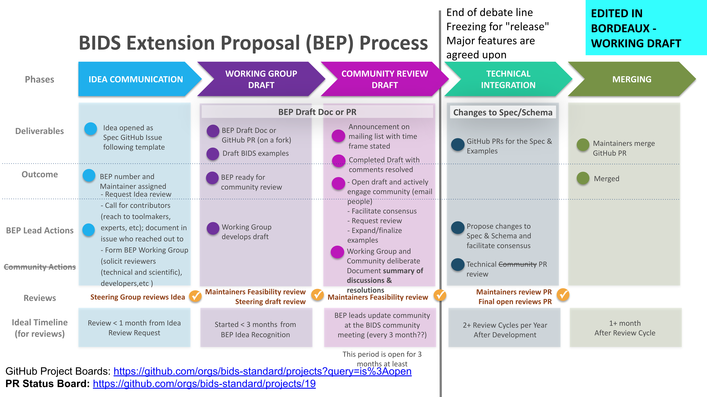

# BEP process

Small contributions (typos, rephrasing of a description, adding a single new metadata field)
euaou
can be proposed as a [Pull Request on GitHub](https://github.com/bids-standard/bids-specification/pulls)
Larger contributions that are expected to involve longer and more involved discussions
may take the form of a BIDS extension proposal (BEP).

A BEP is a method of expanding the BIDS Specification to encompass new features or data types.

They are called BEPs because they are modeled after
[Python Extension Proposals](https://peps.python.org/pep-0001/#what-is-a-pep) (PEPs) as
they have been an effective community tool to change (either by updating or supplementing)
the [Python programming language](https://www.python.org/).
BIDS contributors adopting a similar structure has been useful to expand BIDS.

BEPs have grown the specification beyond its original scope of MRI
to new techniques, and file types and descriptors.
We keep an updated list of
[completed BEPS](./beps.md#completed-beps) and
[draft/proposed BEPs](./beps.md#bids-extension-proposals).

## Is a BEP even required?



!!! warning "Before starting a new extension!"

Developing a new BIDS extension a long process (think years not months)
that requires a lot of work and coordination.

Also take into account,
you may be consulted **years after BEP you workded on is merged into the BIDS specification**,
to advise regarding new updates to this BEP.

So before you embark on this journey, make sure that you have:

-   explored :

    -   [the lists of BEPs](./beps.md)
    -   [opened pull requests related to BEPs](https://github.com/bids-standard/bids-specification/pulls?q=is%3Apr+is%3Aopen+label%3ABEP)
    -   [opened issues related to BEPs](https://github.com/bids-standard/bids-specification/issues?q=is%3Aissue%20state%3Aopen%20label%3ABEP)

    to find existing or ongoing efforts
    that may support what you are trying to add into the BIDS Specification.
    Someone may have already done work for you: so avoid duplicating efforts!

-   familiarized yourself with the BIDS community by browsing current issues,
    discussions, and proposed changes on
    [the bids specification repository][specification_gh].
    Search for [issues](https://github.com/bids-standard/bids-specification/issues) relating to your feature or BEP idea
    before creating a new issue.

If you are sure that you want to move forward, also make sure you have:

-   read the [BIDS governance document](../collaboration/governance.md)
-   the [BIDS code of conduct](../collaboration/bids_github/CODE_OF_CONDUCT.md)

### Overview of the BEP process



*note: I think that it's nearly impossible to try to categorize these in the exact same format
as the attached slide/diagram. However, for this first draft this is nearly 1 to 1 and slightly
edited for clarity for the above image. Additional comments and discussions are also added where
necessary, look for either note: or italicized text*

### Idea Communication

#### Deliverables

-   Open BEP Idea on [Specification Repository](github.come/bids-standard/bids-specification) as Issue with BEP Idea Template

-   Provide an email address to be used for communication with the BEP lead; this address will **be made public** as a matter of
    record alongside the BEP.

#### Outcome

-   BEP number and Maintainer assigned
    -   Request idea review, call for contributors (reach out to tool makers, experts)

#### BEP Lead Actions

-   Call for contributors
    -   reach out to toolmakers, experts, and researchers
    -   document (in issue?) list of contacts from previous steps for future steps

*This could use a bit of work as what we're after is preparing this BEP for the community review process ahead of time.
Steering (and the maintainers present at the discussion in June) would like to see that if things sail along there are
enough experts in the field to satisfy a thorough review of the domain specific criteria of the BEP. In the event that
relevant experts don't wish to engage as either reviewers or working group members this documentation should also be
maintained but not necessarily published.*

#### Reviews

Steering Group Reviews Idea once deliverables are met. Depending on the conclusion of the reviewers the proposed BEP
will move onto one of the following steps:

a) The BEP Lead forms a working group consisting of
\- appropriate parties for the community review step
\- a collection of experts to help draft the initial BEP document and prepare it for community review. Experts are (but not limited to) those of with relevant technical, scientific, or software development skills.

b) The idea is rejected by the Steering Group and the BEP lead is provided with an explanation as to why the BEP will not be moving forward.

c) The BEP lead is asked to modify or address topics raised by the Steering Group for a subsequent review.

#### Timeline (Ideal)

Review < 1 month from Idea Review Request

*The steering group will provide a review of the Idea Request no more than 1 month after it is requested. The intention
being that if a potential BEP lead has a viable BEP Idea that they are quickly able to move forward with it.*

### Working Group Draft

#### Deliverables

-   BEP Draft Document or GitHub pull request made via BEP Lead or BEP Working Group's fork of \[bids-standard/bids-specification(github.com/bids-standard/bids-specification). The BEP Lead should best determine what tool/service they wish to
    collaborate in; previous BEP's have made use of both Google Docs and GitHub.

-   Draft BIDS Examples, these too should exist the most applicable medium for the BEP Working Group

#### Outcome

-   BEP is ready to move onto community review

#### BEP Lead Actions

-   Working group develops draft and BEP lead maintains contact/initiates next steps of process

#### Reviews

-   Maintainers Feasibility Review
-   Steering Draft Review

This part of the process requires an additional review by the BIDS Maintainers which serves to evaluate the technical feasibility of the Draft BEP. Ideally, issues that affect the technical integration of the BEP are caught and corrected at this step.

As in the previous review step Steering and/or Maintainers will work with the BEP Working group to address next steps whether they are revisions or advancement to the Community Review step.

#### Timeline (Ideal)

Started < 3 months from BEP Idea Recognition & BEP Number assignment.

*The ideal, much like the previous step, is to allow the working group is group to move forward to the next part of the
process as rapidly as possible. Following met deliverables BEP Leads are reviewed and advanced by X time. This window
is not hard set. Steering and others felt that when the objectives to move onto the next step are met and a BEP Lead/Working
group requests a review, then a that review must be provided in no more than 3 months. The 3 month window is to allow Steering
and Maintainers to work within the 2 review periods per year structure that already exists.*

### Community Draft Review

#### Deliverables

-   BIDS Mailing list announcement
    -   time frame for review clearly stated
    -   invitation for comments/community engagement solicited
    -   Other information included for example recap of what/why/who/how, links to existing work (PR, Docs)

-   Reviewers collected from the Idea Communication step are contacted and invited for their final input

-   Completed BEP draft will all comments closed/resolved.

#### Outcome

-   Draft is published to the wider community and they are actively engaged (emailed, messaged, invited)

-   Review period is **fixed** following the community review announcement. Once the community review period
    has ended no additional changes or issues may be submitted to the Draft.

*Technical or implementation issues aside, the BEP will be considered final at the end of the review period. The objective of adhering to a hard deadline is to empower BEP Leads and communities to advance their contributions while providing active community contributors an ample window of time to participate in this process.*

#### BEP Lead Actions

-   Facilitate Consensus
-   Request Review
-   Expand/finalize examples following community input and discussion
-   Document community discussions and resolutions to issues arising during community review.
-   Provide summary of community discussions and resolutions for Maintainers

#### Reviews

-   Maintainers feasibilty review

Following (or during) the community review maintainers will help to determine whether

```text
a) The community reviewed version of the BEP is still technically feasible.
b) All other deliverables have been met.
```

For example, it's possible that the community input/review have altered the BEP such that new additions to the
draft are not able to be implemented via the schema expression language and/or are unable to be validated. Sometimes
these issues are more easily fixed at this stage, but often have been resolved after via changes to the schema or
other updates to the standard or tooling. The maintainers will make this determination and provide timely feedback
or solutions to the BEP Lead & Working Group to help them move forward.

#### Ideal Timeline

The community review period should be no less than 3 months (but no more than ??????) in duration to account for community
members time and opportunity to provide input and feedback.

Announcements and review windows may coincide with BIDS/BEP regular community meetings (every 3 months?).

### Technical Integration

From this step forward the focus of BEP is purely technical, the goal of this phase is ensure that the final Merging Phase can pass.

#### Deliverables

Github pull requests open and ready to merge for:

-   github.com/bids-standard/bids-specification
-   github.com/bids-standard/bids-examples

#### BEP Lead Actions

-   propose changes to spec via PR

-   facilitate consensus between spec and examples

-   request feedback from tool developers, experts, collected at Phase 1 (Idea Communication) during
    this semi-final phase.

#### Reviews

Maintainers review and either request changes or approve pull requests for merging.

### Merging

Once this phase is reached a BEP Lead may merge their examples and BEP into their respective repositories. Following the merge the maintainers will publish a new release of the BIDS Specification.

#### Deliverables

-   GitHub pull requests from the Technical Integration phase are merged into their respective repositories at github.com/bids-standard

#### Ideal Timeline

Less than or equal to 1 month after final technical review is finished.

### BIDS Community Meetings and the BEP Process

Community meetings are scheduled to occur once per quarter (every 3 months) and BEP Leads or a BEP Working group member are required to attend. The goals of this meeting are to:

-   speed up and better track BEP development
-   facilitate communication between other BEP's and their BEP Leads (there's often overlap and co-dependencies between extension proposals)
-   provide consistent support to BEP Leads & Working Groups

During the first half of the meeting BEP Leads will have up to 5 minutes allotted provide updates on their BEP.
BEP Leads should be prepared to use their allotted time to discuss the status of their BEP. Updates should include
(but are not limited to) some of the following:

-   Quick updates on changes since the previous meeting; what phase they're presently on and which they expect to reach by the next meeting.

-   Any blockers that might be preventing or slowing them down from progressing to their next phase, these may include:
    -   A missing feature or breaking addition proposed by another BEP
    -   Infrastructure/BIDS bugs (schema expression, validator) that need addressing by maintainers/community
    -   contributor turnover in the working group
    -   delays stemming from lack of feedback/communication from BIDS maintainers/steering

Following the BEP updates, the rest of the community meeting time is reserved for more general discussion. BEP leads may use this forum as an opportunity to raise new issues and communicate
resolutions to previous ones arising from their BEP.

Community members are encouraged to attend to find out more about active BEPS, request major changes, or to simply ask questions about how a BEP might address something they are concerned with.

## BEP paper writing suggestions
