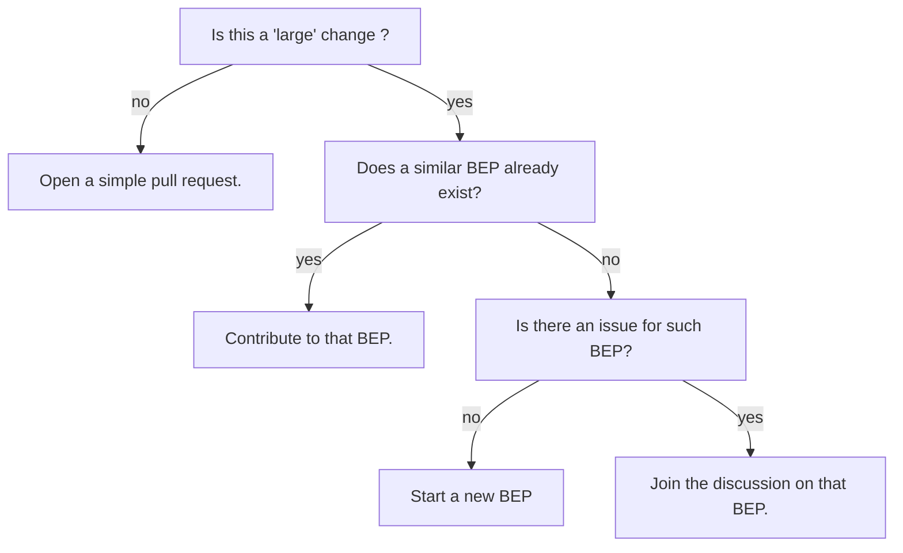
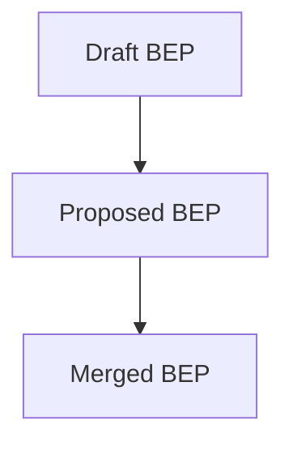
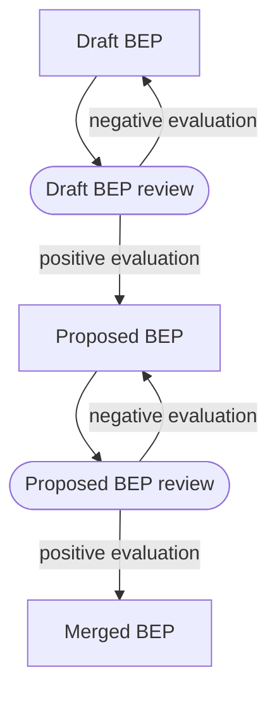
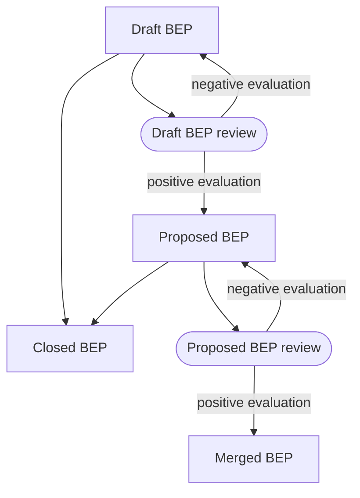
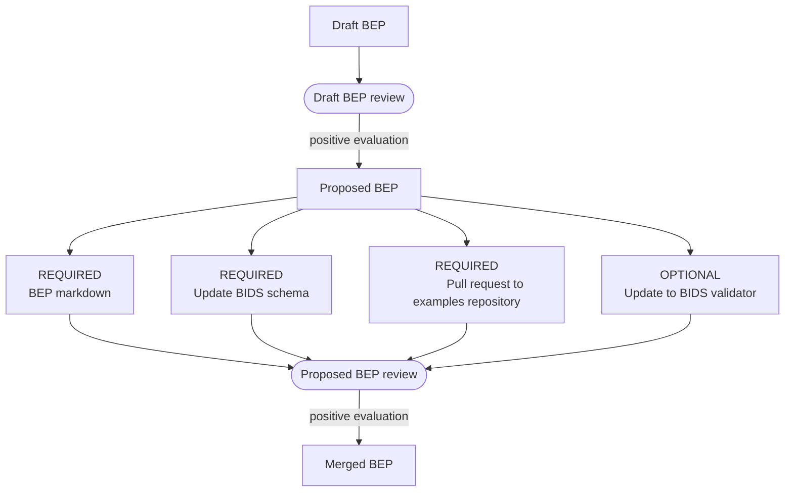
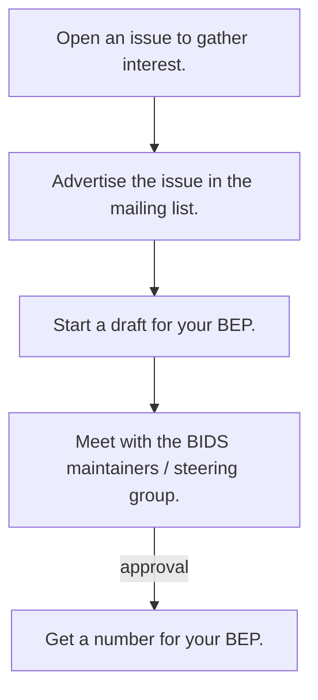

# BEP process

Small contributions (typos, rephrasing of a description, adding a single new metadata field)
can be just added as a [Pull Request on GitHub](https://github.com/bids-standard/bids-specification/pulls)
Larger contributions that are expected to involve longer and more involved discussions
may take the form of a BIDS extension proposal.

A BEP is a method of expanding the BIDS Specification to encompass new features or data types.

They are called BEPs because they are modeled after
[Python Extension Proposals](https://peps.python.org/pep-0001/#what-is-a-pep) (PEPs) as
they have been an effective community tool to change (either by updating or supplementing)
the Python programming language.
BIDS contributors adopting a similar structure has been useful to expand BIDS.

BEPs have grown the specification beyond its original scope of MRI
to new techniques, and file types and descriptors.
We keep an updated list of
[completed BEPS](./beps.md#completed-beps) and
[draft/proposed BEPs](./beps.md#bids-extension-proposals)

## Is a BEP even required?



!!! warning "Before starting a new extension!"

    Developing a new BIDS extension a long process (think years not months)
    that requires a lot of work and coordination.

    Also take into account,
    you may be consulted **years after BEP you workded on is merged into the BIDS specification**,
    to advise regarding new updates to this BEP.

    So before you embark on this journey, make sure that you have:

    -   explored :

        -   [the lists of BEPs](./beps.md)
        -   [opened pull requests related to BEPs](https://github.com/bids-standard/bids-specification/pulls?q=is%3Apr+is%3Aopen+label%3ABEP)
        -   [opened issues related to BEPs](https://github.com/bids-standard/bids-specification/issues?q=is%3Aissue%20state%3Aopen%20label%3ABEP)

        to find existing or ongoing efforts
        that may support what you are trying to add into the BIDS Specification.
        Someone may have already done work for you: so avoid duplicating efforts!

    -   familiarized yourself with the BIDS community by browsing current issues,
        discussions, and proposed changes on
        [the bids specification repository][specification_gh].
        Search for [issues](https://github.com/bids-standard/bids-specification/issues) relating to your feature or BEP idea
        before creating a new issue.

    If you are sure that you want to move forward, also make sure you have:

    -   read the [BIDS governance document](../collaboration/governance.md)
    -   the [BIDS code of conduct](../collaboration/bids_github/CODE_OF_CONDUCT.md)

### Overview of the BEP process

Once a BEP has been opened (see the next [section](#starting-your-bep)),
it goes from `Draft BEP` to `Proposed BEP` to `Merged BEP`.

A `Draft BEP` is usually a Google document (see [governance](../collaboration/governance.md#draft-bep)),
where as `Proposed BEP` refert to pull request to BIDS specification repository
(see [governance](../collaboration/governance.md#proposed-bep)).



The transitions between those stages is decided by a review process.



It may also be decided to close a BEP that is not actually necessary anymore
or is in fact beyond the scope of BIDS.



### Deliverables

In the end a BEP should produce several deliverables
that will be evaluated during the `Proposed BEP review`.



#### REQUIRED deliverables

1.  Extension proposal as one or several markdown files added to the BIDS specification.
1.  Extension of the [`bids-schema`](../standards/schema/index.md) to support the BEP.
1.  Examples (to test the validator is working properly) added to [`bids-examples`][bids_examples_gh].

#### OPTIONAL deliverables

In rare cases, it may be necessary to update the BIDS validator to properly validate new content from a BEP.

#### SUGGESTED deliverables

1.  Preprint of the new extension (if applicable).
3.  Press release for the BIDS website [news section](https://github.com/bids-standard/bids-website/tree/gh-pages/_posts).


### Starting your BEP



To start a new BEP working group, the BIDS governance mentions that you need

>-   a statement of intent with defined scope, deliverables, and use cases
>-   a statement of intent accepted by the BIDS Steering Group

More details on how to proceed are described below.

1.  Open an initial "issue" on
    [the bids specification repository][specification_gh] issues page.

    The issue should describe:

    - defined scope
    - planned deliverables
    - use cases

    This will help gauge interest in your potential BEP, and to collect
    feedback by more community members and
    [BIDS maintainers](https://github.com/bids-standard/bids-specification/blob/master/DECISION-MAKING.md#maintainers-group).

    **This is an important step before proceeding
    in order to make sure
    that more consensus arises and more contributors are aware what is happening.**

<!-- TODO - create an issue template for BEPs -->

1.  Share a link to this issue on the [bids-discussion mailing list][bids_google_group]
    and ask for comments.

1.  Create a working document of your extension by discussing among colleagues.

    Development on Google Docs is RECOMMENDED as this is a low barrier to entry
    for colleagues who do not use GitHub and/or Markdown,
    allowing more people to get involved.
    The [BIDS Extension Proposal template](https://docs.google.com/document/d/1W7--Mf3gCCb1mVfhsoRJCAKFhmf2umG1PFkyZ1jEgMw/edit#)
    provides some boilerplate and formatting conventions.

    !!! important

        - This working document should be opened for comment to anyone.

        - Update the issue from the previous step with a link to this document.

        - Post a link to this document in the [bids-discussion mailing list][bids_google_group].

1.  Contact the BIDS maintainers and steering group
    to evaluate if your BEP is ready to be made official.

    We recommend doing all the following:

    -   tag the BIDS maintainers in using `@bids-standard/maintainers` in the issue of your BEP,
    -   send an email to the BIDS maintainers (`bids.maintenance+question@gmail.com`) and steering group (`bids.steering@gmail.com`).

1.  During this evaluation,
    it should be determined which BIDS maintainer(s) will be in charge of following and advising this BEP.

3.  Once you had approval from the BIDS Steering group,
    register the BEP with a number on the BIDS website.

    To obtain a number for your BEP open [a pull request](https://github.com/bids-standard/bids-website/pulls)
    to the [website GitHub repository][bids_website_gh]
    where you provide information about your BEP
    by updating the file [`data/beps/beps.yml`](https://github.com/bids-standard/bids-website/blob/main/data/beps/beps.yml)
    using the following template:

    ```yaml
    --8<-- ".github/PULL_REQUEST_TEMPLATE/bep_template.yml"
    ```

    !!! note

        This will likely require to add (or update) information about the BEP leads
        in the list of BIDS contributors via [the BIDS specification wiki](https://github.com/bids-standard/bids-specification/wiki/Recent-Contributors#adding-yourself-as-a-contributor).

### Working on your BEP

While working on your extension, make sure to do the following:

-   Follow the [BEP guidelines](./guidelines.md)

-   Keep track of the contributor(s) leading the effort:
    name, affiliation, email...

-   Incorporate the feedback and strive for consensus.

-   Create example datasets.

    !!! note

        Creating datasets may also happen later,
        once you have opened a `Proposed BEP` (see below),
        but we recommend doing this very early even for `Draft BEP`
        as this may provide valuable information with regards
        to the feasibility / complexity of the content of the BEP.

    BIDS datasets must be supplied,
    ideally with their complete source data (for example DICOM, EDF, Excel...),
    along with instructions on how to transform data from source to target.

    When possible, data from multiple vendors should be included.

    These datasets are vital for the development of resources
    that will, ultimately, increase the adoption of the BEP following its integration into the BIDS Specification;
    see [this discussion](https://github.com/bids-standard/bids-specification/issues/1350).

    BIDS maintainers **are available to assist**
    in the collection, organization, or at any step in the preparation of these datasets.


### Draft BEP review

Once you think your `Draft BEP` is mature enough, you can transition to a `Proposed BEP`.

Criteria:

-   Consensus reached among the BEP Working Group.
-   Integrates into the current edition of the standard and is consistent with the BIDS Mission Statement.
-   Clearly defines a filename template and field names.

To confirm your BEP is ready for this transition,
ask for `Draft BEP review` by contacting the BIDS maintainers and steering group by:

-   tagging the BIDS maintainers in using `@bids-standard/maintainers` in the issue of your BEP,
-   sending an email to the BIDS maintainers (`bids.maintenance+question@gmail.com`) and steering group (`bids.steering@gmail.com`)

### Proposed BEP

Once your `Draft BEP` has been positively evaluated, the BIDS maintainers will:

-   Create a new branch off of the `bids-specification` repository

-   Name the branch following the BEP tag convention: `bep###` (e.g. `bep003`)

-   Create a github [BEP team](https://github.com/orgs/bids-standard/teams) for that BEP and add the BEP lead to that team.

    This should ensure that your team has elevated permissions for the pull request for your BEP.

You can then convert working document to markdown and commit it to your BEP branch before opening a pull request.

!!! note

    There is a [google doc add-on](https://workspace.google.com/marketplace/app/docs_to_markdown/700168918607)
    to help you with this.

-  Label your pull requests with your BEP tag
    (this will signal to the community which are for the specification or associated with a specific BEP)

### Proposed BEP review

Criteria:

-   Consensus reached among the BEP Working Group.

-   Integrates into the current edition of the standard and is consistent with the BIDS Mission Statement.

-   Clearly defines a filename template and field names.

-   Use cases and examples clearly illustrated

-   At least 10 business days of community feedback publicly posted across the BIDS channels

-   Proposal positively reviewed by representative community members.
    The definition of "representative" will differ
    depending on the scope of the extension
    and will be reviewed as part of the steering group's final approval.

-   BIDS Steering Group final approval.

The Steering Group evaluates:

-   Sufficiency of community feedback for the scope of the extension
-   Validator updated to include the Proposed BEP specification
-   Final review of the integration into the BIDS standard

The BEP lead(s) will work with the BIDS maintainers to coordinate the community review period.
The community review period is scheduled _after_ the pull request has been opened.

1.  When the branch is ready to be merged, open a pull request against the
    `master` branch to signal the BEP is ready for final reviews. We ask your
    initial pull request to the `master` branch is clean of comments and has one
    commit - adding your extension to the specification. Please let the BIDS
    maintainers know if you need assistance
    [squashing your commits](https://docs.github.com/en/github/collaborating-with-issues-and-pull-requests/about-pull-request-merges#squash-and-merge-your-pull-request-commits).

This document conveys the process for submitting a BEP to BIDS.

This process assumes the BEP is ready to be opened as a pull
request to the
[`bids-specification` repository][specification_gh]
under the [`bids-standard` organization][bids_standard].
Please reach out to
[the BIDS maintainers](https://github.com/bids-standard/bids-specification/blob/master/DECISION-MAKING.md#maintainers-group)
to let them know you are reaching this step in the process. They will assist the
merging of the BEP into the Specification.

## Submitting the validator extension (deprecation warning)

1.  Determine if this is necessary as approved and merged changes to
    to the [schema](https://github.com/bids-standard/bids-specification/tree/master/src/schema)
    will cancel the need to complete the following steps.

1.  Create a new branch off of the `bids-validator` repository

1.  Name the branch following the BEP tag convention: `bep###` (e.g. `bep003`)

1.  Label your pull requests with your BEP tag. This will clearly differentiate
    your work from those of the master branch. Consider opening the pull
    request early to begin getting feedback. Tag
    [Ross Blair (@rwblair)](https://github.com/rwblair)
    in this PR and make sure to have `[WIP]` in the title of the pull request
    to indicate it is a "work in progress".

1.  When the validator is ready to be evaluated, please remove the `[WIP]` from
    the pull request title and tag
    [Ross Blair (@rwblair)](https://github.com/rwblair)

## Submitting the examples

1.  Create a new branch off of the `bids-examples` repository

1.  Name the branch following the BEP tag convention: `bep###` (e.g. `bep003`)

1.  Label your pull requests with your BEP tag. This will clearly differentiate
    your work from those of the master branch

1.  When the examples are ready to be merged, open a pull request
    against the master branch and tag
    [Ross Blair (@rwblair)](https://github.com/rwblair)

## BEP paper writing suggestion

This suggestion is intended to help BEP leads work more transparently while undergoing the BEP paper writing process.
These suggestions are not required for submitting the BEP for incorporation into the BIDS-specification.

-   As the BEP paper is being put together, it may be valuable to share drafts
    with the BIDS community via the
    [bids-discussion google group](https://groups.google.com/g/bids-discussion).
    This will help you gather the most feedback from the BIDS community and
    strengthen the paper.

-   The BEP paper draft can be shared directly on the BEP submission pull request.
    As the pull request is further looked over by the community, the paper can be
    enhanced during the review period.
