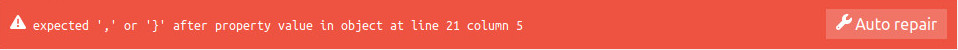
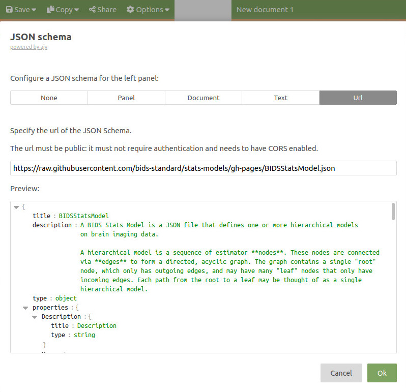

# JSON Files

JSON stands for JavaScript Object Notation
and as its name indicates takes its syntax from the JavaScript language.

JSON files are text files that take the following structure:

```json
{
    "key": "value",
    "key2": "value2",
    "key3": {
        "subkey1": "subvalue1"
    }
}
```

Note that they can be nested (curly brackets within curly brackets).
Here are some common ways to read / write these files.

- [Official documentation about JSON](https://www.json.org/json-en.html)

## Editing JSON file

### Online

Working with JSON can be a headache if you do not have the proper tools.

To get started we suggest playing around with JSON in an online editor,
to get a feeling for how JSON works.

See for example this one: [http://jsoneditoronline.org/](http://jsoneditoronline.org/)

Online editors can also usually tell you if you forgot a comma,
forgot to close a bracket or something similar.
And even fix mistakes for you.



### On your computer

If you need to edit JSON files on your computer, it will make your life easier
if you use a modern code editor like:

-   [visual studio code](https://code.visualstudio.com/)

Modern code editors can tell you if you have a valid JSON file
and highlight the lines where you have errors.
Most of them usually also have code formatting extensions
that can automatically indent your JSON like
[Prettier for vscode](https://marketplace.visualstudio.com/items?itemName=esbenp.prettier-vscode)

### Python

In Python, JSON support is built [into the core library](https://docs.python.org/3/library/json.html),
meaning you don't need to install anything to read/write JSON files.
In addition, the structure of JSON is almost identical
to that of Python dictionaries (assuming you are only storing text / numbers in the dictionary).

### MATLAB / Octave

Since MATLAB R2016b
and [Octave](https://octave.org/) >= 7.1 (an open-source drop-in compatible with many Matlab scripts),
you can use the built-in functions
[`jsonencode`](https://www.mathworks.com/help/matlab/ref/jsonencode.html)
and [`jsondecode`](https://www.mathworks.com/help/matlab/ref/jsondecode.html)
to help your read and write JSON files.

!!! note -- "bids-matlab and other libraries"

    There are also several toolboxes in MATLAB or Octave
    for reading / writing JSON files.

    [bids-matlab](https://github.com/bids-standard/bids-matlab) has functions
    ([`bids.util.jsonencode`](https://bids-matlab.readthedocs.io/en/main/utility_functions.html#bids.util.jsonencode)
    and [`bids.util.jsondecode`](https://bids-matlab.readthedocs.io/en/main/utility_functions.html#bids.util.jsonencode))
    that act as wrappers and will use whatever implementation (MATLAB, Octave...) is available.

    The [JSONio library](https://github.com/gllmflndn/JSONio) will allow you to read
    and write JSON files with MATLAB and Octave with the `jsonread` and `jsonwrite` functions.

    SPM12 uses the JSONio library by calling `spm_jsonwrite` and `spm_jsonread` and
    it has [other interesting functions to help you with BIDS](https://en.wikibooks.org/wiki/SPM/BIDS).

### R

There are several packages for reading and writing JSON files from R.
In the examples in this page, we will be using [jsonlite](https://github.com/jeroen/jsonlite).
Remember to install and call a package before using it.

<!-- There is a new package to help intract with BIDS datasets: [bidser](https://github.com/bbuchsbaum/bidser) -->

## Reading a `.json` file

=== "python"

    ```python
    import json
    with open('myfile.json', 'r') as ff:
        metadata = json.load(ff)
    ```

=== "MATLAB"

    For MATLAB >= R2016b

    ```matlab
    % Read JSON data from a file
    jsonStr = fileread('myfile.json');
    % Convert JSON string to MATLAB variables
    jsonData = jsondecode(jsonStr);
    ```

=== "octave"

    The example below uses the [JSONio library](https://github.com/gllmflndn/JSONio).

    ```matlab
    metadata = jsonread('myfile.json')
    ```

=== "R"

    The example below uses the [jsonlite](https://github.com/jeroen/jsonlite) library.

    ```R
    # install jsonlite in case you did not already do it
    # install.packages('jsonlite')
    library(jsonlite)
    metadata = fromJSON('myfile.json')
    ```

## Writing a `.json` file

=== "python"

    ```python
    import json
    metadata = {'field1': 'value1', 'field2': 3, 'field3': 'field3'}
    with open('my_output_file.json', 'w') as ff:
        json.dump(metadata, ff)
    ```

=== "MATLAB"

    ```matlab
    metadata = struct('field1', 'value1', 'field2', 3, 'field3', 'field3')
    jsonencode('my_output_file.json', metadata);
    ```

=== "octave"

    The example below uses the [JSONio library](https://github.com/gllmflndn/JSONio).

    ```matlab
    metadata = struct('field1', 'value1', 'field2', 3, 'field3', 'field3')
    jsonwrite('my_output_file.json', metadata)
    ```

=== "R"

    The example below uses the [jsonlite](https://github.com/jeroen/jsonlite) library.

    ```R
    # install jsonlite in case you did not already do it
    # install.packages('jsonlite')
    library(jsonlite)
    metadata <- list(field1 = "value1", field2 = 3, field3 = "field3")
    metadata = toJSON(metadata, pretty=TRUE)
    write(metadata, "my_output_file.json")
    ```

## Interoperability issues

!!! warning -- "Summary of this section"

    In general, use key names that:

    -   start with a letter,
    -   contain only letters, numbers, and/or the underscore character,
    -   are no longer than 63 characters.

Many parts of JSON files are often loaded as
[`structures`](https://nl.mathworks.com/help/matlab/ref/struct.html) by MATLAB / Octave,
where a `key` in a JSON file becomes `fieldname` in that structure.

Here is an example with a simple `example.json`

```json
{
    "key": "value"
}
```

loaded with bids-matlab

```matlab
>> json_content = bids.util.jsondecode('example.json')

json_content =

  struct with fields:

    key: 'value'
```

There are however some strict rules for what makes a valid fieldname in MATLAB and Octave.

Fieldnames must:

-   start with a letter, otherwise assigning to that field will error

-   contain only letters, numbers, and/or the underscore (`_`) character, otherwise assigning to that field will error, and

-   must be no longer than `namelengthmax` (currently 63) characters, otherwise
    you will receive a warning and the field name will be truncated

If there are keys in your JSON that do not comply to those rules,
they keys will be renamed when loading which can lead to some headaches down the line.

For example when loading the `bad_keys.json`

```json
{
    "@foo": "@foo",
    "1": "1",
    "x1": "x1",
    "x_1": "x_1",
    "/t": "/t",
    "%f": "%f"
}
```

We get some quite different fieldnames when read with MATLAB:

```matlab
>> jsondecode(fileread('bad_keys.json'))

ans =

  struct with fields:

    x_foo: '@foo'
       x1: '1'
     x1_1: 'x1'
      x_1: 'x_1'
      x_t: '/t'
      x_f: '%f'
```

or with JSONio for Octave (though at least here we get a warning):

```matlab
>> jsonread('bad_keys.json')
Warning: Duplicate key.

ans =

  struct with fields:

    x_foo: '@foo'
       x1: 'x1'
      x_1: 'x_1'
      x_t: '/t'
      x_f: '%f'
```

This can lead to some unexpected behavior if you did not know about this.

If you load this `collision.json`

```json
{
    "1": "1",
    "x1": "x1",
    "x_1": "x_1"
}
```

and try to retrieve the value associated to the `key` `x1`, you will in fact be
getting the value for the key `1`.

```matlab
>> json_content = bids.util.jsondecode('collision.json');
>> json_content.x1

       x1: '1'
```

### Why does this matter for BIDS?

In most cases this will not be an issue,
but this could be problem if in your `events.tsv`
you have named some of your trial_type things like `1_face`,
`2_sound` and then want to annotate those events in a side car JSON file like this.

```json
{
    "trial_type": {
        "LongName": "",
        "Description": "image type",
        "Levels": {
            "1_face": "A face is displayed",
            "2_sound": "A sound is played"
        }
    }
}
```

If you do this, it will be much harder to work with that JSON file for anyone who uses MATLAB or Octave.

!!! warning

    So in general here are some suggestions on how to name your events:

    -   start with a letter
    -   make sure they contain only letters, numbers, and/or the underscore (`_`) character
    -   make sure they are no longer than 63 characters

## More about JSON

This section below gives you more in depth details about using JSON.

### JSON terms

The main "building blocks" of JSON you must be familiar with are `Objects` and `Arrays`.

#### Objects

In JSON, objects

-   are opened and closes by curly brackets `{ }`

-   are a collection of key-value pairs where:

    -   the keys are strings
    -   the key and the value are separated by a colon `:`

For example, this is an object.

```json
{ "Key": "value", "Key2": 1 }
```

As you can see, in JSON strings start and end with double quotes `"`.
Also note the comma between the key-value pairs but not after the last key-value pair.

#### Arrays

In JSON, arrays are:

-   are opened and closes by square brackets `[ ]`
-   an ordered list of zero or more elements, each of which may be of any type (string, number..)
-   elements must be separated by a comma

```json
["this", "is", 1, "JSON", "array"]
```

#### A note on Booleans

In JSON boolean values must be typed as lowercase with no quotes:

-   `true`
-   `false`

### JSON "styling"

In JavaScript it is custom to use CamelCase to write code,
this is why most of keys you will see in JSON are also in CamelCase.

<!-- TODO Add link to camelcase wikipedia -->

For example:

```json
{ "ThisIsTrue": true, "ThisIsTrue": false }
```

It is common to indent JSON files to improve readability.

```json
{
  "ThisIsTrue": true,
  "ThisIsTrue": false
}
```

Finally, you cannot add comments in JSON files,
but the BIDS stats model allows you to add a `"Description"` key
to most objects to give explanations to the reader.

### Nesting

JSON allows to "nest" objects within objects, to create arrays of objects
and combine all those elements however deep you want or need.

Just remember to place commas:

-   between array elements
-   between key-value pairs
-   unless this is the last element (or key-value pair)

```json
{
  "MixedArray": ["This", "is", "one", "array"],
  "ArrayOfNumbers": [0, 0, 1, 0, 0],
  "ArrayOfObjects": [
    {
      "NestedObject": true,
      "Content": { "value": 0 }
    },
    {
      "NestedObject": false,
      "Content": 1
    }
  ]
}
```

### JSON schema

If the content of your JSON must follow certain rules, like

!!! warning

    your JSON file must contain a key-value pair:

    -   with a key called: "Version"
    -   with a value that must be a number

Then you can specify those rules in what is called a JSON schema.

#### Online

If you are working on a JSON file in the browser like with [http://jsoneditoronline.org/](http://jsoneditoronline.org/),
and if there is a JSON schema for the JSON file you are working on
you can also use that schema to validate while editing
by clicking `Options --> JSON schema --> URL`
and give it the URL to the schema.

See the example below using the [BIDS stats model schema](https://bids-standard.github.io/stats-models/BIDSStatsModel.json):



#### On your computer

If you want to validate a JSON file you are editing using a JSON schema
you can do so by adding the following key-value pair in your BIDS stats model,
(here using the BIDS stats model schema as an example)

```json
  "$schema": "https://raw.githubusercontent.com/bids-standard/stats-models/gh-pages/BIDSStatsModel.json",
```

For vs-code you can also add this to your settings:

```json
"json.schemas": [
    {"fileMatch": [
            "model-*_smdl.json"
        ],
        "url": "https://raw.githubusercontent.com/bids-standard/stats-models/gh-pages/BIDSStatsModel.json"
    }
]
```

[Source](https://code.visualstudio.com/docs/languages/json#_json-schemas-and-settings)

Example of JSON syntax error and BIDS stats model schema error in VS code:


