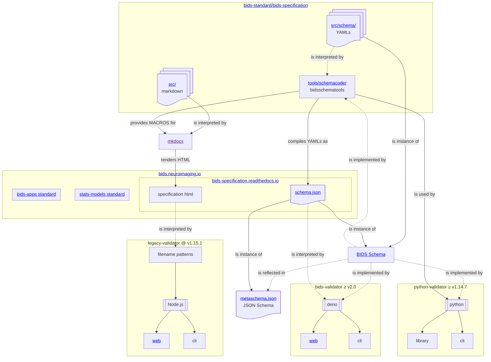

# BIDS Standards

The current set of BIDS Standards provide outlines and guidance
for file naming and organization, statistical modeling of neuroimaging data,
and applications created to be used with BIDS data.
These standards are intended to be updated and evolve as methods and data types change,
but current documentation on BIDS standards can be found in the sections below.

You can find further information for:

-   the [BIDS specification](./bids_specification/index.md)
-   the [BIDS schema](./schema/index.md)
-   the [BIDS statistical model specification](.//bids_stats_model/index.md)
-   the [BIDS apps specification](./bids_app_specification/index.md)

The following figure shows the relationship between the BIDS specification, validator implementations, and the BIDS schema:

