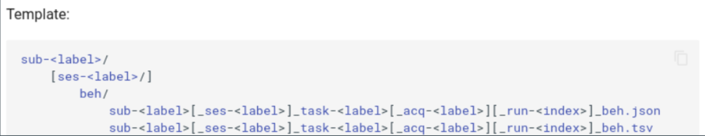
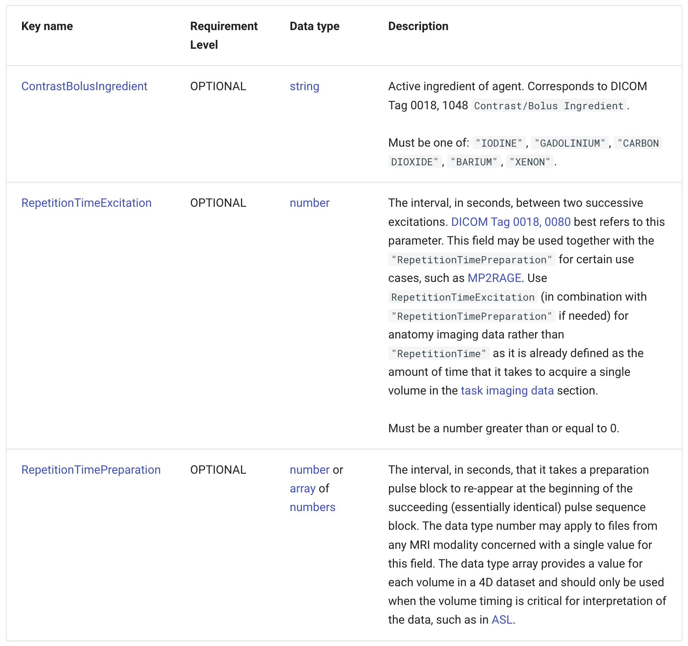
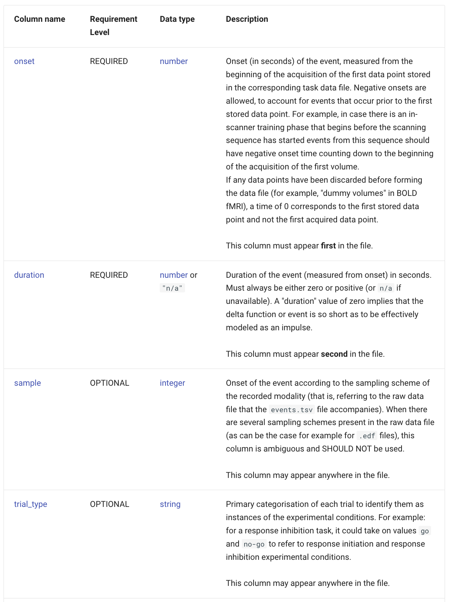

# Rules

## rules.files

[`rules.files`](https://github.com/bids-standard/bids-specification/tree/master/src/schema/rules/files): Filename construction rules

[`rules.files.common`](https://github.com/bids-standard/bids-specification/tree/master/src/schema/rules/files/common): Top-level (dataset_description.json) and tables (participants.tsv)

???+ "dataset_description"

    ```yaml
    dataset_description:
    level: required
    path: dataset_description.json
    ```

??? "participants"

    ```yaml
    participants:
    level: optional
    stem: participants
    extensions:
        - .tsv
        - .json
    ```


[`rules.files.raw`](https://github.com/bids-standard/bids-specification/tree/master/src/schema/rules/files/raw): Data files defined in "BIDS-Raw"

??? "rules.files.raw.anat.nonparametric"

    ```yaml
    nonparametric:
    suffixes:
        - T1w
        - T2w
        - PDw
        - T2starw
        - FLAIR
        - inplaneT1
        - inplaneT2
        - PDT2
        - angio
        - T2star # deprecated
        - FLASH # deprecated
        - PD # deprecated
    extensions:
        - .nii.gz
        - .nii
        - .json
    datatypes:
        - anat
    entities:
        subject: required
        session: optional
        task: optional
        acquisition: optional
        ceagent: optional
        reconstruction: optional
        run: optional
        part: optional
    ```

[`rules.files.deriv`](https://github.com/bids-standard/bids-specification/tree/master/src/schema/rules/files/deriv): Data files defined in "BIDS-Derivatives"

[`rules.files.raw.beh.noncontinuous`](https://github.com/bids-standard/bids-specification/tree/master/src/schema/rules/files/raw/beh.yaml):

??? "beh_noncontinous"

    ```yaml
    # Non-continuous data
    noncontinuous:
    suffixes:
        - beh
    extensions:
        - .tsv
        - .json
    datatypes:
        - beh
    entities:
        subject: required
        session: optional
        task: required
        acquisition: optional
        run: optional
    ```

    

---

## rules.sidecars

[`rules.sidecars`](https://github.com/bids-standard/bids-specification/tree/master/src/schema/rules/sidecars): Sidecar construction rules

[`rules.sidecars.anat.MRIAnatomyCommonMetadataFields`](https://github.com/bids-standard/bids-specification/tree/master/src/schema/rules/sidecars/anat.yaml)

???+ "MRIAnatomyCommonMetadataFields"

    ```yaml
    MRIAnatomyCommonMetadataFields:
    selectors:
        - modality == "mri"
        - datatype == "anat"
    fields:
        ContrastBolusIngredient: optional
        RepetitionTimeExcitation: optional
        RepetitionTimePreparation: optional
    ```

    

---

## rules.tabular_data

[`rules.tabular_data`](): TSV construction rules

[`rules.tablular_data.task.TaskEvents](https://github.com/bids-standard/bids-specification/tree/master/src/schema/rules/tabular_data/task.yaml)

???+ "TaskEvents"

    ```yaml
    TaskEvents:
    selectors:
        - '"task" in entities'
        - suffix == "events"
    columns:
        onset: required
        duration: required
        trial_type: optional
        ...
    additional_columns: allowed
    initial_columns:
        - 'onset'
        - 'duration'
    ```

    

---

## rules.checks

[`rules.checks`](https://github.com/bids-standard/bids-specification/tree/master/src/schema/rules/checks): Dataset consistency rules, relies heavily on an expression language
If all selectors are true, the rule applies to a file; if any check fails, the issue is raised.

[`rules.checks.dwi.DWIVolumeCount](https://github.com/bids-standard/bids-specification/tree/master/src/schema/rules/checks/dwi.yaml)

???+ "DWIVolumeCount"

    ```yaml
    DWIVolumeCount:
    issue:
        code: VOLUME_COUNT_MISMATCH
        message: |
        The number of volumes in this scan does not match the number
        of volumes in the corresponding .bvec and .bval files.
        level: error
    selectors:
        - suffix == "dwi"
        - '"bval" in associations'
        - '"bvec" in associations'
    checks:
        - associations.bval.n_cols == nifti_header.dim[4]
        - associations.bvec.n_cols == nifti_header.dim[4]
    ```

---

## One-off rules

- [`rules.entities`](https://github.com/bids-standard/bids-specification/blob/master/src/schema/rules/entities.yaml): Global order of entities
- [`rules.dataset_metadata`](https://github.com/bids-standard/bids-specification/blob/master/src/schema/rules/dataset_metadata.yaml): Contents of dataset_description.json and genetic_info.json, constructed similarly to [rules.sidecars](#rulessidecars)
- [`rules.modalities`](https://github.com/bids-standard/bids-specification/blob/master/src/schema/rules/modalities.yaml): Grouping of data types by "modality" (somewhat ill-defined)
- [`rules.common_principles`](https://github.com/bids-standard/bids-specification/blob/master/src/schema/rules/common_principles.yaml): Order of BIDS terms listed in "Common principles" section
- [`rules.errors`](https://github.com/bids-standard/bids-specification/blob/master/src/schema/rules/errors.yaml): Error messages found in the validator that cannot be schematized (e.g., NIFTI_HEADER_UNREADABLE), intended to promote consistency across tooling
