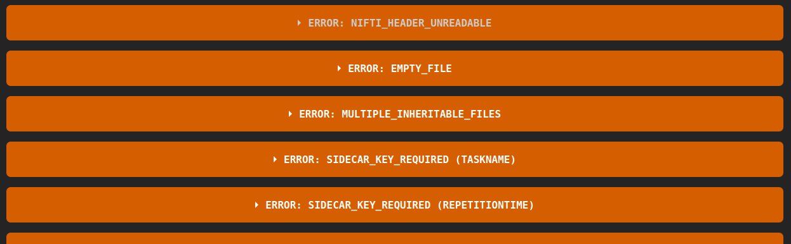
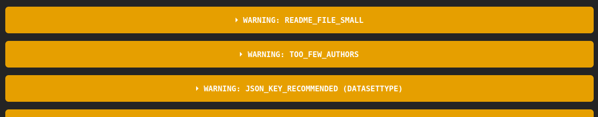

# BIDS validation

The [BIDS Validator](https://github.com/bids-standard/bids-validator) is a tool
that checks if a dataset is compliant with the BIDS standard.
The validator is available for use within several different environments
to best suit individual user preferences and use cases, those versions are:

-   [A web browser based version](https://bids-standard.github.io/bids-validator/)
-   [Command line version](https://bids-validator.readthedocs.io/en/latest/user_guide/command-line.html)
-   [Docker based version](https://hub.docker.com/r/bids/validator)
-   A [python library](https://github.com/bids-standard/python-validator) installable from [pypi](https://pypi.org/project/bids-validator/) or [conda-forge](https://anaconda.org/conda-forge/bids-validator)

Instructions to install and use these versions can be found
within the [quickstart guide](https://github.com/bids-standard/bids-validator)
at the BIDS Validator repository.

## Data Privacy and Confidentiality

Please note that the web app is entirely browser (not server) based.
As such, there is no file uploading as part of the validation.

## Browser Version

1.  The BIDS Validator can be found at <http://bids-standard.github.io/bids-validator/>.
    It requires that you use the Chrome or Firefox browser,
    since those are the only ones in which you can select a whole folder rather than individual files.

    

1.  You can then choose the **folder** that you wish to validate

### Types of Feedback

!!! failure "Error"

    This response indicates that your dataset is not BIDS compliant.
    Try following the suggestions listed to make the appropriate corrections.

    

!!! warning

    This response indicates that your dataset is BIDS compliant,
    but there are some non-critical problems
    (such as recommended fields missing, or differences between participants).

    

!!! success "Success :rocket:"

    This response indicates that your folder contains a valid BIDS Dataset!

    <!--  -->

## Command Line Version

### Verifying a BIDS compliant data set

After [installation with deno](https://bids-validator.readthedocs.io/en/latest/user_guide/command-line.html#using-the-command-line)
using the CLI is relatively simple.
Locate a bids data set similar to the one below:

```bash
user@host:~/bids-examples$ tree pet001

sub001/
├── dataset_description.json
├── participants.json
├── participants.tsv
├── README
└── sub-01
    └── ses-01
        ├── anat
        │   ├── sub-01_ses-01_T1w.json
        │   └── sub-01_ses-01_T1w.nii
        └── pet
            ├── sub-01_ses-01_trc-CIMBI36_pet.json
            ├── sub-01_ses-01_trc-CIMBI36_pet.nii.gz
            ├── sub-01_ses-01_trc-CIMBI36_recording-autosampler_blood.json
            ├── sub-01_ses-01_trc-CIMBI36_recording-autosampler_blood.tsv
            ├── sub-01_ses-01_trc-CIMBI36_recording-manual_blood.json
            └── sub-01_ses-01_trc-CIMBI36_recording-manual_blood.tsv
```

Now simply point the bids validator at the folder path of the subject(s) in question:

```bash
user@host:~/bids-examples$ bids-validator pet001
```

### Types of Feedback

!!! failure "Error"

    As is the case with the browser or any version of the validator follow
    the `[ERROR]` messages and correct until bids-validator returns 0 errors after running.

    ```bash
    [ERROR] NIFTI_HEADER_UNREADABLE We were unable to parse header data from this NIfTI file. Please ensure it is not corrupted or mislabeled.
                /sub-01/ses-01/anat/sub-01_ses-01_T1w.nii

        Please visit https://neurostars.org/search?q=NIFTI_HEADER_UNREADABLE for existing conversations about this issue.
    ```

!!! warning

    As stated with the browser version above, one may elect to ignore warnings,
    but the information provided via the validator should help to pinpoint
    where and how to resolve some of these warnings.
    When in doubt consult the [BIDS specification](https://bids-specification.readthedocs.io/en/latest/)

    ```bash
    [WARNING] JSON_KEY_RECOMMENDED A JSON file is missing a key listed as recommended.
                DatasetType
                /dataset_description.json

                GeneratedBy
                /dataset_description.json

                SourceDatasets
                /dataset_description.json

        Please visit https://neurostars.org/search?q=JSON_KEY_RECOMMENDED for existing conversations about this issue.
    ```

!!! success "Success :rocket:"

    Pass go and collect 200 dollars, the data set in question passes validation.

    ```bash
    user@host:~/bids-examples$ bids-validator sub001

          Summary:                         Available Tasks:        Available Modalities:
          12 Files, 224 kB                                         PET
          1 - Subjects 1 - Sessions                                MRI

        If you have any questions, please post on https://neurostars.org/tags/bids.
    ```
